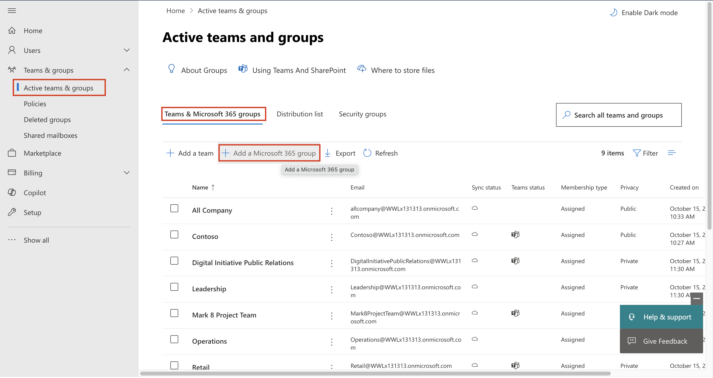
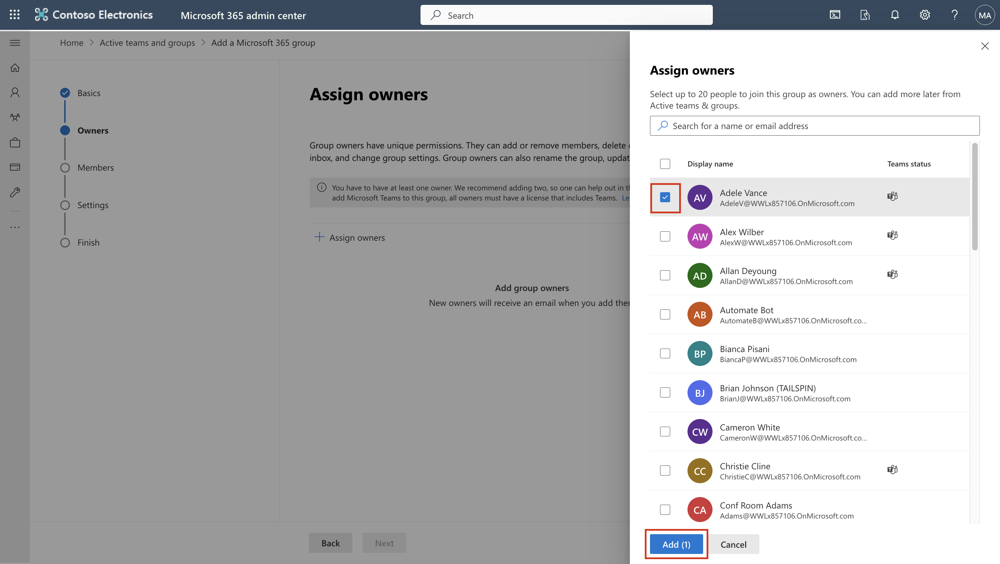
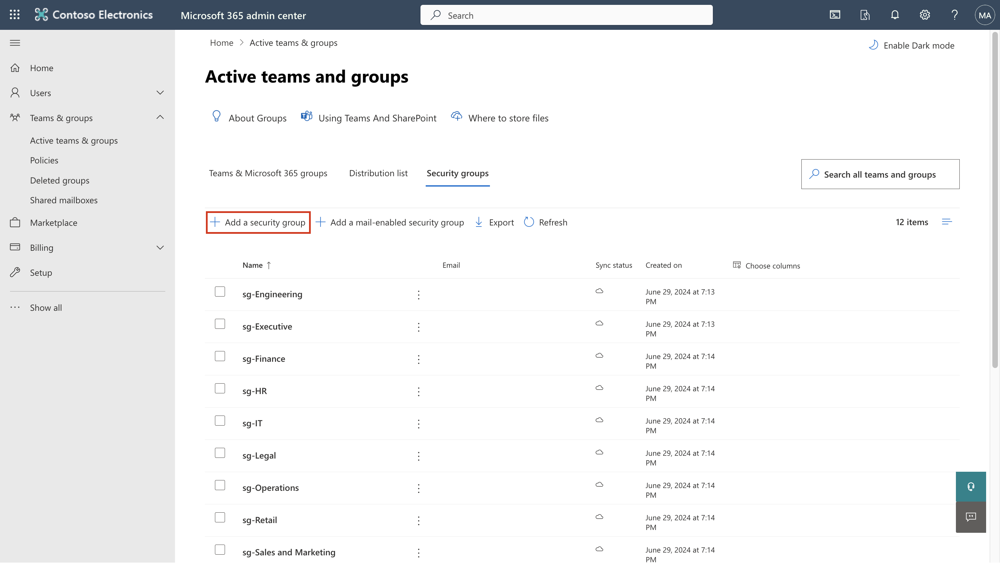

# Lab 1 – Assigning Compliance Roles and exploring Microsoft Purview portal

## Objective:

In this lab we create users and assign them appropriate roles, teams,
and groups in the Office 365 admin center to represent an
organisation—Contoso.

We also assign the following to the Users:

- Trial for compliance Assessments

Later, we will test **Microsoft 365 built-in** **Office 365 Message
Encryption (OME)**.

Firstly, we will modify the default template to ensure that no social
IDs dialog is displayed for external recipients when receiving a message
protected with Office 365 Message Encryption from users of the
organisation that we set up.

Then we will create a new custom OME configuration and create a
transport rule to apply the OME configuration to all mails sent from our
finance department.

## Exercise 1 - Managing Compliance Roles

In this exercise we will be activating all the trial licenses required
for implementing security with Microsoft Purview.

### Task 1 – Adding Manager role to an existing user.

1.  Log into the VM with the account details provided in
    the **resources** tab of your lab. Log in to the Microsoft 365 admin
    center **```https://admin.microsoft.com```** using Administrative
    Username and Administrative Password.

2.  From the left pane, select **Users** \> **Active users**, and click
    on the first user **Adele Vance**.


3.  Under **Manager**, Click **Edit manager**.


4.  Remove the current manager and type **Patti** in the search box.
    Select **Patti Fernandez**. Click **Save Changes**.


5.  Change the manager to Patti Fernandez for all the users who have
    been assigned the licenses.

6.  For Patti Fernandez, add **MOD Administrator** as the manager.

### Task 2 – Adding a Compliance Administrator

1.  Select the user **Patti Fernandez**, under **Account**, scroll
    to **Roles** and click on **Manage roles**.


2.  Once the **Roles** pane opens, check the radio button near **Admin
    center access**, and expand **Show all by category.**


3.  Scroll to **Security & compliance**, check the box
    beside **Compliance Administrator**, and click on **Save changes**.


Stay on the same page and continue to the next task.

### Task 3 – Creating teams and groups in Microsoft admin center

1.  Now expand **Teams & groups**, select **Active teams & groups** and
    click on **Add a Microsoft 365 group** under Teams & Microsoft 365
    groups.


2.  For name use **```Contoso** **Finance Team```**, and for description
    use **```This team handles finance.```**, and then click
    on **Next**.


3.  On the **Assign Owners** page, click on **Assign owners**, check the
    box besides **Adele Vance**, and click on **Add(1)**. Click
    on **Next**.


4.  On the **Add members** page add **Adele Vance** as a member,
    click **Next**.

5.  For group email address use **```contfosofinance```** and then
    click **Next**.


6.  Click on **Create group**.


7.  Once done, click on **Close**.


8.  On the **Active teams & groups page**, select **Security
    groups** tab. Select **Add a security group.**


9.  Repeat the steps to create another group with the following
    information.

- On the **Set up the basics**, enter the following to
  the **Name** field: **```EDM_DataUploaders```**. In the
  **Description** field, enter **```People who will upload
  data for EDM```**.

- Select **Next**.

- On the **Settings** page, select **Next**.

- On the **Review and finish adding group** page, review your settings
  and select **Create group**.

- When the **New group created** page is shown, select newly created
  **EDM_DataUploaders** group.

- Select **View all and manage owners**, and add **Patti Fernandez** and
  **Christie Cline**.

- Similarly add **Christie Cline** as the member.


### Task 4 – Enabling trial for compliance Assessments

1.  Log in to the Purview Portal **```https://purview.microsoft.com```**
    using Administrative Username and Administrative Password.

2.  If a welcome window is displayed, agree to the terms and
    select **Get started** and close it.


3.  Scroll down and under Trials and recommendations, select **View all
    trials and recommendations**.


4.  On the **Microsoft Purview trials and recommendations** page, go
    to **Compliance assessments**, under **Purview and Priva
    trials** and select **Try now**.


5.  Click on **Start Trials**.


Note: It might take up to 2 hours for the changes to take effect. Sign
in again to see the new features .In the meantime, continue with next
steps.

6.  From the navigation bar select **Solutions** \> **Audit**.


7.  On the **Audit** page, select **Start recording user and admin
    activity** to activate audit logging.


## Exercise 2 - Managing Office 365 Message Encryption

The first setting **Patti Fernandez** needs to configure and test with
his pilot team is the **Microsoft 365 built-in** **Office 365 Message
Encryption (OME)**. For this purpose, he will modify the default
template and create a new branding template, that will be assigned to
one of the pilot users. The pilot users will then test the OME
functionality with their accounts.

### Task 1 – Verifying Azure RMS functionality

In this task, you will install the **Exchange Online PowerShell** module
and verify the correct Azure RMS functionality of your tenant.

1.  Open an **elevated PowerShell** window by selecting the Windows
    button with the right mouse button and then run **Windows
    PowerShell** as administrator.


2.  Confirm the **User Account Control** window with **Yes**.

3.  Enter the following cmdlet to install the latest Exchange Online
    PowerShell module version:

**```Install-ModuleExchangeOnlineManagement```**


4.  Confirm the **NuGet** provider security dialog with **Y**for Yes and
    press **Enter**. This process may take some seconds to complete.


5.  Confirm the Untrusted repository security dialog with **Y** for Yes
    and press **Enter**. This process may take some seconds to complete.


6.  Enter the following cmdlet to change your execution policy and
    press **Enter**

**```Set-ExecutionPolicy -ExecutionPolicy RemoteSigned -Scope CurrentUser```**


7.  Confirm the Execution Policy Change with  **Y** for Yes and
    press **Enter**.


8.  Enter the following cmdlet to use the **Exchange Online
    PowerShell** module and connect to your tenant:

**```Connect-ExchangeOnline```**


9.  When the **Sign in** window is displayed, sign in as **Patti
    Fernandez** using the username PattiF@WWLxXXXXXX.onmicrosoft.com and
    the User Password given on your resources tab.

10. Verify Azure RMS and IRM is activated in your tenant by using the
    following cmdlet and press **Enter**:

**```Get-IRMConfiguration | fl AzureRMSLicensingEnabled```**

11. When **AzureRMSLicensingEnabled** result is **True**, Azure RMS is
    activated for your tenant. Continue with the next step.



12. Test the Azure RMS templates used for Office 365 Message Encryption
    against the demo pilot user **Adele Vance** by using the following
    cmdlet (replace WWLxXXXXXX with your tenant prefix given on the
    resources tab)

**```Test-IRMConfiguration -Sender
adelev@WWLxXXXXXX.onmicrosoft.com -Recipient
adelev@WWLxXXXXX.onmicrosoft.com```**

13. Verify all tests are in the status PASS and no errors are shown.


14. Leave the **PowerShell** window open.

You have successfully installed the Exchange Online PowerShell module,
connected to your tenant, and verified the correct functionality of
Azure RMS.

### Task 2 – Modifying default OME template

Next, there is a requirement in your organization to restrict trust for
foreign identity providers, such as Google or Facebook. Because these
social IDs are activated by default for accessing messages protected
with OME, you need to deactivate the use of social IDs for all users in
your organization.

1.  Run the following cmdlet to view the default OME configuration:

**```Get-OMEConfiguration -Identity"OME Configuration" |fl```**


2.  Review the settings and confirm that
    the **SocialIdSignIn** parameter is set to **True**.



3.  Run the following cmdlet to restrict the use of social IDs for
    accessing messages from your tenant protected with OME:

**Set-OMEConfiguration -Identity"OME
Configuration" -SocialIdSignIn:$false**


4.  Confirm the warning message for customizing the default template
    with **Y** for Yes and press Enter.


5.  Check the default configuration again and validate,
    the **SocialIdSignIn** parameter is now set to **False**.

**```Get-OMEConfiguration -Identity"OME Configuration" |fl```**

6.  Notice the result should show the **SocialIDSignIn**is set
    to **False**.


7.  Leave the **PowerShell window** **open** and proceed to next
    exercise.

You have successfully deactivated the usage of foreign identity
providers, such as Google and Facebook in Office 365 Message Encryption.

### Task 3 – Testing Modified OME template

You must confirm that no social IDs dialog is displayed for external
recipients when receiving a message protected with Office 365 Message
Encryption from users of your tenant and they need to use the OTP at any
time accessing the encrypted content.

1.  In **Microsoft Edge**, open a **New InPrivate Window** and navigate
    to **```https://outlook.office.com```** and log into Outlook on the web
    with the username **```AdeleV@WWLxXXXXXX.onmicrosoft.com```** and the User
    Password given on your resources tab.

2.  On the **Stay signed in?** dialog box, select the **Don’t show this
    again** checkbox and then select **No**.

3.  If a **Translate page from…** window is shown, select the arrow down
    and select **Never translate from…**.

4.  Select **New mail** from the upper left side part of Outlook on the
    web.


5.  In the **To** line enter your personal or other third-party email
    address that is not in the tenant domain.
    Enter **Secret Message** to the subject line
    and **```My super-secret message.```** to the body.


6.  From the top pane go to **Options** pane, select **Encrypt** to
    encrypt the message.


7.  Once you've successfully encrypted the message, you should see a
    notice that says "**Encrypt: This message is encrypted. Recipients
    can't remove encryption.**"


8.  Select **Send** to send the message.


In the trial account you will not have the privilege to send any email
but you can check out the following steps to understand how to test the
template when you have your own licenses. Your mail will not be able to
reach the receiver from your current tenant.

9.  Sign in to your personal email account and open the message from
    Adele Vance. If you sent this email to a Microsoft account (like
    @outlook.com) the encryption may be processed automatically and you
    will see the message automatically.

**Note:** If you sent the email to another email service like
(@google.com), you may have to perform the next steps to process the
encryption and read the message. You may need to check your junk or spam
folder for the message.

10. Select **Read the message**.

11. Without having social IDs activated, there is no button to
    authenticate with your Google account.

12. Select **Sign in with a One-time passcode** to receive a limited
    time passcode.

13. Go to your personal email portal and open the message with
    subject **Your one-time passcode to view the message**.

14. Copy the passcode, paste it in to the OME portal and
    select **Continue**.

15. Review the encrypted message.

You have successfully tested the modified default OME template with
deactivated social IDs.

### Task 4 – Creating custom branding template

Protected messages sent by your organizations finance department require
a special branding, including customized introduction and body texts and
a Disclaimer link in the footer. The finance messages shall also expire
after seven days. In this task, you will create a new custom OME
configuration and create a transport rule to apply the OME configuration
to all mails sent from the finance department.

1.  In the PowerShell window that we left open with Exchange Online
    connected. run the following cmdlet to create a new OME
    configuration:

**```New-OMEConfiguration -Identity"Finance
Department" -ExternalMailExpiryInDays 7```**


2.  Confirm the warning message for customizing the template
    with **Y** for Yes and press **Enter**.


3.  Change the introduction text message with the following cmdlet:

**```Set-OMEConfiguration -Identity "Finance
Department" -IntroductionText "from Contoso Ltd. Finance department has
sent you a secure message." ```**



4.  Confirm the warning message for customizing the template
    with **Y** for Yes and press **Enter**.


5.  Change the body email text of the message with the following cmdlet:

**```Set-OMEConfiguration -Identity "Finance
Department" -EmailText "Encrypted message sent from Contoso Ltd. finance
department. Handle the content responsibly." ```**

6.  Confirm the warning message for customizing the template
    with **Y** for Yes and press **Enter**.


7.  Change the disclaimer URL to point to Contoso's privacy statement
    site:

**```Set-OMEConfiguration -Identity "Finance
Department" -PrivacyStatementURL"https://contoso.com/privacystatement.html"```**


8.  Confirm the warning message for customizing the template
    with **Y** for Yes and press **Enter**.


9.  Use the following cmdlet to create a mail flow rule, which applies
    the custom OME template to all messages sent from the Contoso
    finance team. This process may take a few seconds to complete.

**```New-TransportRule -Name "Encrypt all mails from Contoso Finance
team" -FromScopeInOrganization -FromMemberOf "Contoso Finance
Team"-ApplyRightsProtectionCustomizationTemplate"Finance
Department" -ApplyRightsProtectionTemplate Encrypt```**


10. Type the following cmdlet to verify changes.

**```Get-OMEConfiguration -Identity"Finance
Department" | Format-List```**


11. Leave the **PowerShell** open.

You have successfully created a new transport rule that applies the
custom OME template automatically, when a member of the finance
department sends a message to external recipients.

### Task 5 – Testing the custom branding template

To validate the new custom OME configuration, you need to use the
account of Adele Vance, who is a member of the finance team. In the
trial account you will not have the privilege to send any email but you
can check out the following steps to understand how to test the template
when you have your own licenses. You can perform step 1 - 4 but your
mail will not be able to reach the receiver from your current tenant.

1.  In **Microsoft Edge**, open a **New InPrivate Window** and navigate
    to **https://outlook.office.com** and log into Outlook on the web
    with the username **adelev**@**WWL**xXXXXXX.onmicrosoft.com and the
    User Password given on the resources tab.


2.  Select **New message** from the upper left side part of Outlook on
    the web.

3.  In the **To** line enter your personal or other third-party email
    address that is not in the tenant domain.
    Enter **Finance Report** to the subject line and
    enter **Secret finance information.** to the body.

4.  Select **Send** to send the message.

5.  Sign in to the email account you used above and open the message
    from Veronica Quek.

6.  You should see a message from **Adele Vance** that looks like the
    image below. Select **Read the** **message**.


7.  If you want to read the message, perform the following steps.

    1.  Click on **Read the message**. Select **Sign in with a One-time
        passcode** to receive a limited time passcode.

    2.  Go to your personal email portal and open the message with
        subject **Your one-time passcode to view the message**.

    3.  Copy the passcode, paste it in to the OME portal and
        select **Continue**.

    4.  Review the encrypted message with custom branding.

You have successfully tested the new customized OME template

## Summary:

In this lab we successfully replicated an organisation in our admin
center, assigned appropriate licenses and learnt how to use Microsoft
365 built-in Office 365 Message Encryption (OME).
