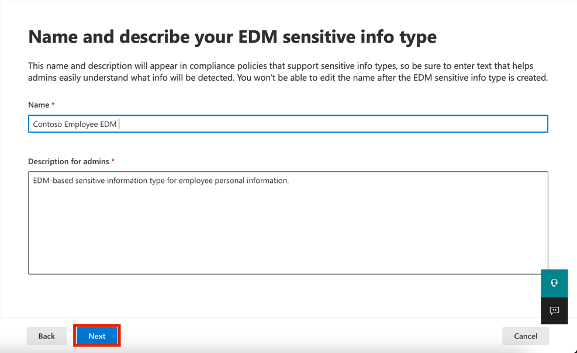

# Lab 2 – Managing Sensitive Information Types​

## Objective:

Contoso Ltd. previously had issues with employees accidentally sending
out personal information from customers when working on support tickets
in the ticketing solution.

To educate users in the future, a custom sensitive information type is
required to identify employee IDs in emails and documents, which consist
of three uppercase characters and six numbers, using Sensitive info
types. To lower the false positive rate, the keywords "Employee" and
"IDs" will be used.

In this Lab you will create:

- a new custom sensitive information type

- a database for EDM-based classification

- keyword dictionary

## Exercise 1 – Creating Custom Sensitive Information Types

In this exercise, you will use the **Security & Compliance Center
PowerShell** module to create a new custom sensitive information type
that recognizes the pattern of employee IDs near the keywords "Employee"
and "ID".

1.  In **Microsoft Edge**, open a **New InPrivate Window**, navigate
    to **+++**https://**purview**.microsoft.com**+++** and log in as
    **Patti Fernandez** using the
    username **PattiF@WWLxXXXXXX.onmicrosoft.com** and the User Password
    given on your resources tab.

2.  From the left navigation, select **Solutions** \> **Data Loss
    Prevention**.

3.  Select **Classifiers** from the left pane. Select **Sensitive info
    types** from the sub-navigation pane. Select **+Create sensitive
    info type** to open the wizard for a new sensitive information type.

4.  On the **Name your sensitive info type** page, enter the following
    information:

    - **Name**: **+++Contoso Employee IDs+++**

    - **Description**: **+++Pattern for Contosoemployee IDs+++.**

5.  Select **Next**.

6.  On the **Define patterns for this sensitive info type** page,
    select **Create pattern**.

7.  In the right-side **New pattern** pane, select **Add primary
    element** and select **Regular expression**.

8.  In the new right-side pane **Add a regular expression**, enter the
    following:

    - **ID**: **+++Contoso IDs+++**

    - **Regular expression**: **+++\s\[A-Z\]{3}\[0-9\]{6}\s+++**

    - Select **String match**

9.  Select **Done**.

10. In the right-side **New pattern** pane again, below **Supporting
    elements**, select **+ Add supporting elements or group of
    elements** drop-down menu and select **Keyword list**.

11. In the new right-side pane **Add a keyword list**, enter the
    following:

    - **ID**: **+++Employee ID keywords+++**

    - **Case insensitive**:

**+++Employee**

**ID+++**

12. Select the radial for ***Word match*** under the **Case
    Sensitive** field

13. Select **Done**.

14. In the New pattern windows decrease the **Character
    proximity** value to ***100*** characters.

15. Select the **Create** button.

16. Back on the **Define patterns for this sensitive info type** page
    select **Next**.

17. On the **Choose the recommended confidence level to show in
    compliance policies** page, use the default value and
    select **Next**.

18. On the **Review settings and finish** page review the settings and
    select **Create**. When successfully created select **Done**.

19. Leave the browser window open.

You have successfully created a new sensitive information type to
identify employee IDs in the pattern of three uppercase characters, six
numbers, and the keywords 'Employee' or 'IDs' within a range of 100
characters.

## Exercise 2 – Creating EDM-based classification information type

As an extra search pattern, you will create an EDM-based classification
with a database schema of employee data. The database source file will
be formatted with the following data fields of employees: Name,
Birthdate, StreetAddress, and EmployeeID.

1.  Select **Solutions** \> **Data Loss Prevention** \> **Classifiers**,
    navigate to **EDM classifiers**, switch off **New EDM experience**,
    and from EDM Schema, select **+ Create EDM schema** to create a new
    schema definition.

2.  In the **Name** field, enter **+++employeedb+++**.

3.  In the **Description** field,
    enter **+++Employee Database schema.+++**.

4.  Enable **Ignore delimiters and punctuation for all schema fields**.

5.  Click the dropdown for **Choose delimiters and punctuation to
    ignore** and select **Hyphen**, **Period**, **Space**, **Open
    parenthesis** and **Close parenthesis**.

6.  In the first Schema field name, enter **+++Name+++** and mark
    the **Field is searchable** box.

7.  Select **+ Add schema data field** from the lower end.

8.  In **Schema field name**, below **Schema field \#2**,
    enter **+++Birthdate+++**.

9.  Select **+ Add schema data field** from the lower end again.

10. In **Schema field name**, below **Schema field \#3**,
    enter **+++StreetAddress+++**.

11. Select **+ Add schema data field** from the lower end a last time.

12. In **Schema field name**, below **Schema field \#4**,
    enter **+++EmployeeID+++**.

13. Select **Field is searchable**.

14. Select **Save**.

15. Select **EDM sensitive info types** from the left pane and
    select **+ Create EDM sensitive info type** to open the **EDM rule
    package** wizard.

16. On the **Define data store schema** page, select **Choose an
    existing EDM schema**.

17. Select **employeedb** and select **Add**.

18. Review the data store schema and select **Next**.

19. On the **Define patterns for this EDM sensitive info type** page,
    select **+ Create pattern**.

20. On the **New pattern** pane on the right-side, in the **Primary
    element** field, select ***EmployeeID***.

21. Below **Primary element's sensitive info type**, select **Choose
    sensitive info type**.

22. In the **Search** bar, enter ***Contoso*** and press the enter key.

23. Select **Contoso Employee IDs** and select **Done**.

24. Select **Done**.

25. Select **Next** in the *Define patterns for this EDM sensitive info
    type* screen.

26. In the **Choose the recommended confidence level and character
    proximity** let the default value persist and select **Next**.

27. In the **Name and describe your EDM sensitive info type** page,
    enter **+++Contoso Employee EDM+++** for the name.

28. In the **Description for admins** field, enter **+++EDM-based
    sensitive information type for employee personal information.+++**.
    Select **Next.**

29. Review the settings and select **Submit**.

30. On the **Your EDM sensitive info type was created** page,
    select **Done**.

31. Leave the browser open with the Microsoft Purview portal.

You have successfully created a new EDM-based classification sensitive
information type for identifying employee data from a database file
source.

## Exercise 3 – Creating EDM-based classification data source

To associate the EDM-based classification with a database containing
sensitive data, hashing and uploading the actual data for the sensitive
information type via the EDM Upload Agent tool is required next.

1.  In **Microsoft Edge**, navigate
    to **+++**https://go.microsoft.com/fwlink/?linkid=2088639**+++** to
    access the EDM download agent.

2.  Select **Run** to download and install the tool.

3.  In the **Microsoft Exact Data Match Upload Agent Setup** wizard,
    select **Next**.

    - Select **I accept the terms in the License Agreement** and
      select **Next**.

    - Do not change the default **Destination Folder** path and
      select **Next**.

    - Select **Install** to perform the installation.

    - When the **User Account Control** window opens, select **Yes**.

    - If asked to log in, log in via **Patti’s** account.

    - When the installation finishes, select **Finish**.

    - Select the Windows symbol in the lower left to open the start
      menu, enter **Notepad** and select **Notepad** from the start
      menu.

    - Enter the following text to the first line in the notepad window:

**+++Name,Birthdate,StreetAddress,EmployeeID**

**Patti Fernandez,01.06.1980,1Main Street,CSO123456**

**Christie Cline,31.01.1985,2Secondary Street,CSO654321+++**

4.  Select File and Save As: **+++EmployeeData.csv+++**

5.  Select the dropdown at **Save as type:** and select **All Files
    (*.*)**.

6.  Select the dropdown at **Encoding:** and select **UTF-8** and
    select **Save**.

7.  Close the Notepad window.

8.  Select the windows symbol in the taskbar with the right mouse button
    and select **Windows PowerShell (Admin)** and run as administrator.

9.  When the **User Account Control** window opens, select **Yes**.

10. Navigate to the EDM Upload Agent directory:

**+++cd "C:\Program Files\Microsoft\EdmUploadAgent"+++**

11. Authorize with your Account to upload the database to your tenant by
    running the following cmdlet:

**+++.\EdmUploadAgent.exe /Authorize+++**

12. When the **Pick an account** window is displayed, log in as **Patti
    Fernandez** using the username **PattiF@WWLxXXXXXX.onmicrosoft.com**
    and the User Password given on your resources tab. (Or the new
    password you reset.)

Note: For the next steps, please make sure that the path of the files
resembles the path in your VM. It may be different than the instructions
or the screenshots. In such case please change the path of your file in
the commands accordingly.

13. Download the database schema definition of the EDM-based
    classification sensitive information type by running the following
    script in PowerShell:

**+++.\EdmUploadAgent.exe /SaveSchema /DataStoreNameemployeedb /OutputDir
”C:\Users\Admin\Documents\\+++**

**Note**: If the last command fails, it possibly takes more time until
the **EDM_DataUploaders** group membership is applied. It can take up to
one hour until it is possible to download the schema file. If it fails
proceed to the next task and return to this step later. Or check the
path the documents folder on your VM.

14. Hash the database file and upload it to the EDM-based classification
    sensitive information type by running the following script in
    PowerShell:

**+++.\EdmUploadAgent.exe /UploadData/DataStoreName employeedb /DataFileC:\Users\Admin\Documents\EmployeeData.csv /HashLocation C:\Users\Admin\Documents\\/SchemaC:\Users\Admin\Documents\employeedb.xml+++**

**Note:** If you get the following errors

Error Type: System.IO.FileNotFoundException

Error Message: Unable to find the specified file.

Check the path where you saved the file EmployeeData.csv

15. Check the upload progress until the state changes to completed then
    run the following PowerShell command:

**+++.\EdmUploadAgent.exe /GetSession /DataStoreNameemployeedb+++**

You have successfully hashed and uploaded a database file for a
EDM-based classification sensitive information type.

## Exercise 4 – Creating Keyword Dictionary

Several violations of personal information leakage happened when users
sent out emails after colleagues reported on sick leave. When that
happened the reason for illness or disease was sent out. We do not want
that to happen.

1.  In **Microsoft Edge**, open a **New InPrivate Window**, navigate
    to **+++https://purview.microsoft.com+++** and log in as **Patti
    Fernandez** using the username **PattiF@WWLxXXXXXX.onmicrosoft.com**
    and the User Password given on your resources tab.

2.  From the left navigation, select **Solutions** \> **Data Loss
    Prevention**.

3.  Select **Classifiers** from the left pane. Select **Sensitive info
    types** from the sub-navigation pane. Select **+Create sensitive
    info type** to open the wizard for a new sensitive information type.

4.  On the **Name your sensitive info type** page, enter the following:

    - Name: **+++Contoso Diseases List+++**

    - Description: **+++List of possible diseases of employees.+++**

5.  Select **Next**.

6.  On the **Define patterns for this sensitive info type** page,
    select **+ Create pattern**.

7.  Select the dropdown field below **Primary element** and
    select **Keyword dictionary**.

8.  In the **Add a keyword dictionary** page enter the
    name **+++*Diseases Dictionary*+++**.

9.  In the **Keywords** area enter the following keywords, each into a
    separate line:

**+++flu**

**influenza**

**cold**

**bronchitis**

**otitis+++**

10. Select **Done**.

11. Below **Supporting elements**, select **+ Add supporting elements or
    group of elements** drop-down and select **keyword list** to add
    additional support for the keyword dictionary.

12. In the **Add a keyword list** page enter **Employee absence** in
    the **ID** field. In the **Case insensitive** box, enter the
    following keywords, each into a separate line:

**+++employee**

**absence**

**reason+++**

13. Select **Done**.

14. In the **New pattern** page, review the configuration and
    select **Create**.

15. In the **Define patterns for this sensitive info
    type** select **Next**.

16. In the **Choose the recommended confidence level to show in
    compliance policies** let the default value persist and
    select **Next**.

17. In the **Review settings and finish** page, review your settings and
    select **Create**. When the process is complete select **Done**.

18. Leave the browser window in the Microsoft Purview portal open.

You have successfully created a new sensitive information type based on
a keyword dictionary and added more keywords to decrease the false
positive rate. Proceed with the next task.

## Exercise 5 – Working with custom Sensitive Information Types

Custom Sensitive information types should always be tested before using
them in policies otherwise data loss or leakage may occur due to a
malfunctioning custom search pattern.

1.  Select the Windows symbol in the lower left to open the start menu,
    enter **Notepad** and select **Notepad** from the start menu.

2.  Enter the following text to the notepad window:

**+++Employee Patti Fernandez EMP123456 is on absence because of the
flu/influenza+++**

3.  Select **File** and Save As **SickTestData** and select **Save**.

4.  Close the Notepad window.

5.  In **Microsoft Edge**, the Microsoft Purview portal tab should still
    be open. If so, select it and proceed to the next step. If you
    closed it, then in a new tab, navigate
    to **+++https://purview.microsoft.com+++**. Log in as **Patti
    Fernandez** using the username **PattiF@WWLxXXXXXX.onmicrosoft.com**
    and the User Password given on your resources tab.

6.  In the left navigation pane select **Solutions** \> **Data Loss
    Prevention**, then select the **Sensitive info types** under
    **Classifiers** . In the **Search** box from the upper right side
    and enter ***Contoso*** and press **Enter**. Select **Contoso
    Employee IDs** to open the right side pane.

7.  Select **Test** from the right-side pane.

8.  On the **Upload file to test** page, select **Upload file**.

9.  Select **Documents** from the left pane, select the file with the
    name **SickTestData** and select **Open**.

10. Select **Test** to start the analysis.

11. On the **Match results** page, review the found match.

12. Select **Finish** and close the test page by clicking
    the **X** button.

13. Back on the **Data classification** page, select the Sensitive
    Information Type with the name **Contoso Diseases** **List**.

14. In the right side pane, select **Test**.

15. On the **Upload file to test** page, select **Upload file**.

16. Select **Documents** from the left pane, select the file with the
    name *SickTestData* and select **Open**.

17. Select **Test** to start the analysis.

18. On the **Match results** page, review the found match. When done
    review select **Finish**.

## Summary:

You have successfully tested the two custom sensitive information types
and validated the search pattern recognizes the desired patterns. You
have finished the creation of sensitive information types and can
proceed with the next exercise.
