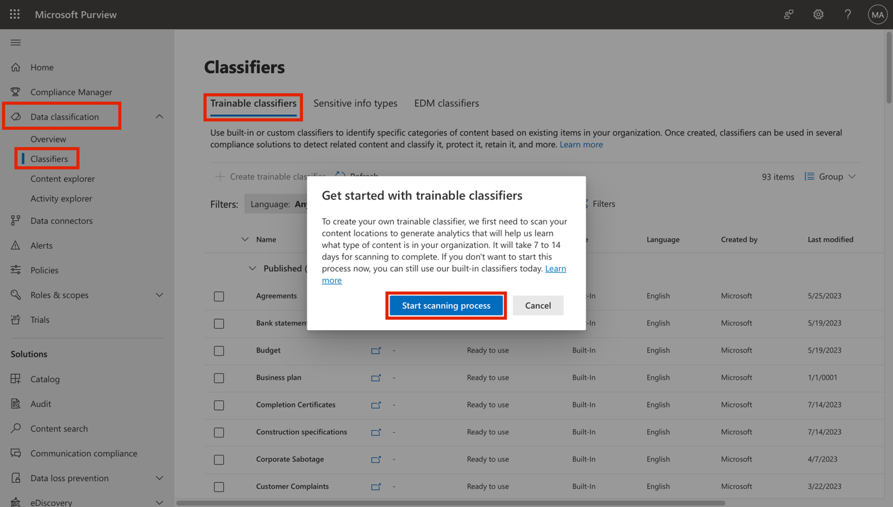
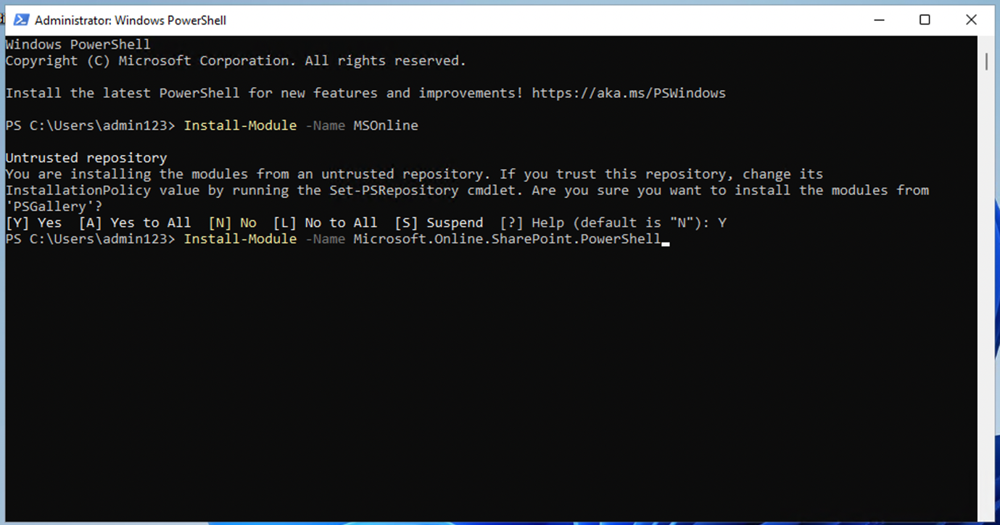

# Lab 3 – Managing Trainable Classifiers

## Objective:

The Contoso Ltd. tenant contains a SharePoint site collection with the
name "Sales and Marketing" that will be used in the future to store
several financial related documents and reports. Because of the nature
of these documents, you need to create a trainable classifier to
recognize and label these files. For this purpose, you will activate
custom trainable classifiers and create a new one in this lab.

**Important!:** After activating trainable classifiers in a tenant, it
takes between 7 and 14 days before any custom trainable classifiers can
be created. The button to create a new trainable classifier will not be
available until the entire activation process is complete. Therefore,
you will only be able to perform task 1 now. If you wish to complete
task 2 and 3 you will need to wait until processing of the trainable
classifier setup is complete. The Microsoft 365 tenant you're using to
perform task 1 should still be active for 30 days along with your
environment.

## Exercise 1 – Activating trainable classifiers

Before you can create custom trainable classifiers, you need to activate
the feature in a tenant. To activate the Global Admin permissions are
required, you will sign out of Patti Fernandez's account and use the MOD
Administrator to activate the feature first.

1.  In **Microsoft Edge**, navigate
    to **https://compliance.microsoft.com.**

2.  Log into the portal as **MOD Administrator** using the credentials
    provided in the resources tab of your lab environment.


3.  Navigate to **Classifiers** under **Data Classification** from the
    left navigation pane and select **Trainable classifiers** from the
    top pane.

4.  When you see the **Get started with trainable classifiers** window,
    select **Start scanning process**.



5.  Refresh the browser window.

6.  Read the information banner at the top of the window with the
    message **To set you up for creating trainable classifiers, we're
    currently scanning your content locations to generate analytics that
    will help us learn what type of content is in your organization.
    This process will take 7 to 14 days to complete**.

7.  Leave the client open.

You have successfully activated trainable classifiers in your tenant.
You will now need to wait between 7 and 14 days until the **Create
trainable classifiers** button becomes available. If you are in a
classroom setting and do not have 7 to 14 days to wait for Trainable
Classifiers to complete processing, you may perform the remainder of the
tasks in this exercise by logging into the tenant you were provided
later when the Trainable Classifiers processing is complete. Your tenant
should still be active.

**Note**:

Next exercises will require the trainable classifiers that were created,
to be live. You can perform these exercises after that as a homework
task.

## Exercise 1 – Creating a trainable classifier

In this task, Patti will create a new trainable classifier and select
different SharePoint sites for identifying typical data created and
stored by Contoso Ltd.

1.  In **Microsoft Edge**, open a **New InPrivate Window**, navigate
    to **```https://purview.microsoft.com```** and log in as **Patti
    Fernandez** using the username **PattiF@{TENANTPREFIX}.onmicrosoft.com**
    and the User Password given on your resources tab.

2.  From the left navigation, select **Solutions** \> **Data Loss
    Prevention**.

```

3. Expand **Classifiers** from the left pane. Select **Trainable
    Classifiers** from the sub-navigation pane. Select **+ Create
    trainable classifier** to create a new classifier.



4. Enter the following information on the **Name and describe your
    trainable classifier** page:

    - Name: **```Contoso Company Data```**

    - Description: **```Trainable classifier for company data produced and
    stored by Contoso Ltd.```**

5. Select **Next**.


6. Select **Choose sites** to open the right side pane.


7. Select the following SharePoint sites and select **Add**.

    - Brand

    - Digital Initiative Public Relations

    - Work

    - Sales and Marketing

    - Mark 8 Project Team


8. Wait until the chosen site is shown in the list and select **Next**.


9. On the **Source of the negative sample content page**, select the
    site **Learn**, and then select **Next**.

10. Review the settings and select **Create trainable classifier**.


11. When the message Your trainable classifier was created is shown,
    select **Done**.

The documents and files in the chosen SharePoint site are now being
analyzed, which can take up to 24 hours.

You can explore the already existing classifiers for further review.

## Summary:

You have successfully created a custom trainable classifier that matches
the files stored on the existing SharePoint sites of Contoso Ltd.
