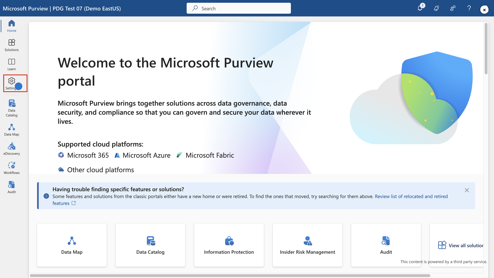
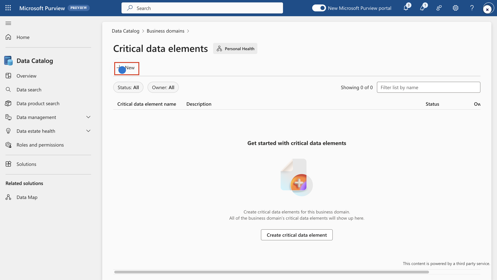
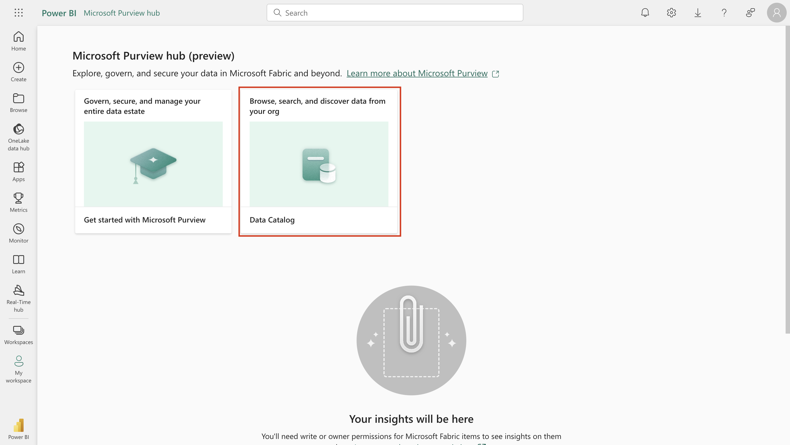
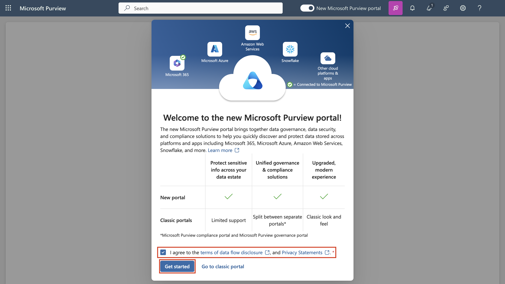
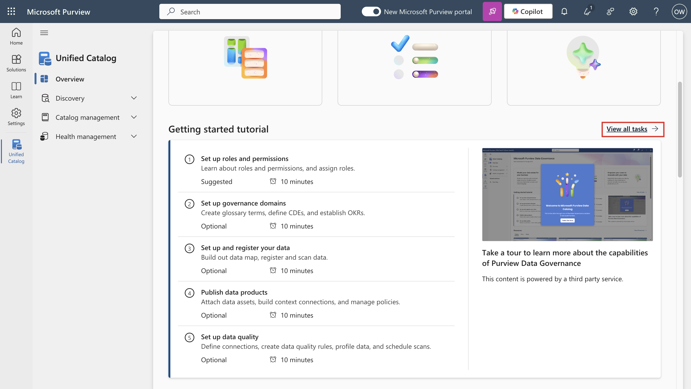
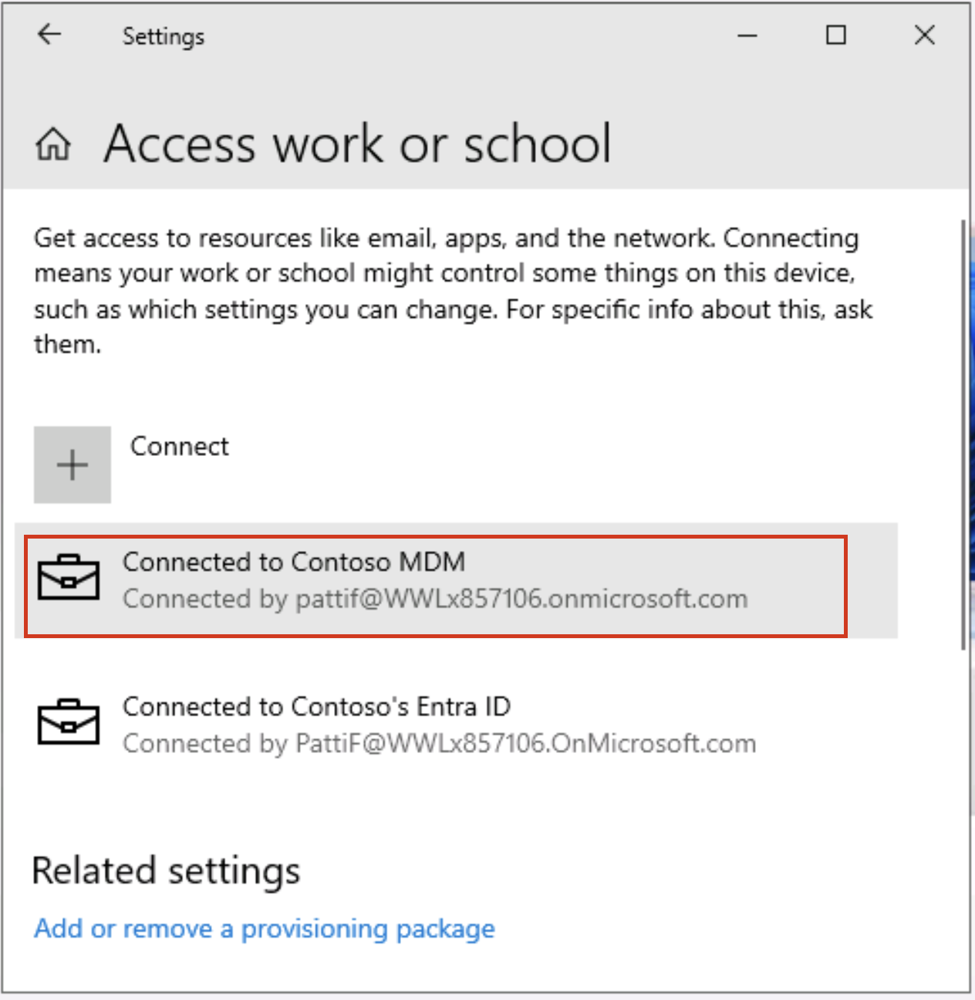
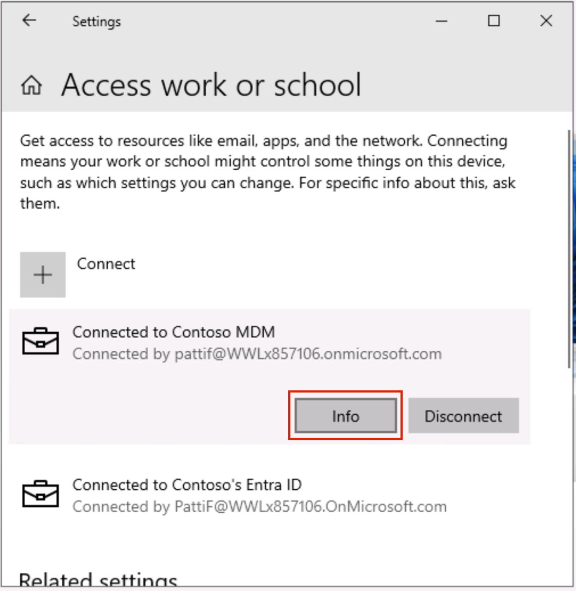
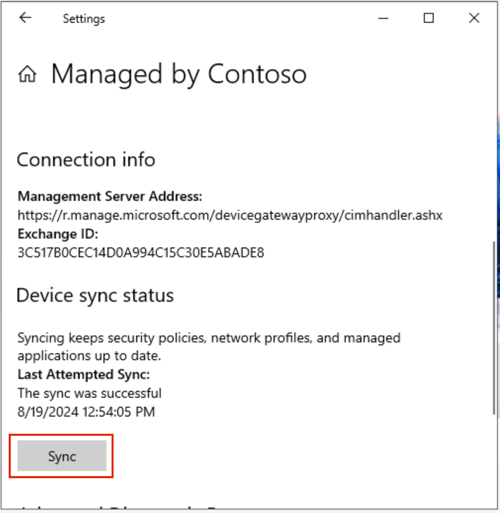

# Lab 5 – Configuring prerequisites for Insider Risk Management

## Objective:

In this lab we will learn how to configure Insider Risk Management using
the Insider Risk Management Policies. We will use the Sensitive Info
Types that we created in Lab 2 and DLP policies that we created in Lab 5
to create policies which will secure the organisation against risky
browser usage or any data theft or leaks.

To do this we will create an infrastructure in Azure that will represent
the devices in an organisation. We will learn how to onboard those
devices in Azure AD and Intune, and install an MDM agent on them, so
that they can be used to get the alerts from those machines.

## Exercise 1: Set up the environment

### Task 0 : Synchronize the VM clock

1.  After logging into the VM, select the windows icon. Then search
    for **Date and time**, and select **Date and time settings**.

2.  On the Settings screen that opens up, click on the **Sync
    now** under Additional settings.

3.  This takes care of synchronizing the time just in case the automatic
    synchronization does not work.

### Task 1: Redeem the Azure Pass

#### Redeeming a Microsoft Azure Pass Promo Code

1.  Open a browser and navigate to: **+++www.microsoftazurepass.com+++**

It is recommended you close all browsers and open a new In-Private
Browser session. Other log-ins can persist and cause errors during the
activation step.

2.  Click the **Start** button to get started.

3.  Enter your Microsoft 365 tenant credentials and select Sign In.

4.  Click **Confirm Microsoft Account** if the correct email address is
    listed.

5.  Enter your **Azure Pass** promo code in the Enter Promo code box and
    click “**Claim Promo** **Code**”.

6.  It may take up to 5 minutes to process the redemption.

#### Activate your subscription

1.  When the redemption process is completed, it will redirect to the
    sign up page.

2.  Enter your account information and click **Next**.

3.  Click the agreement check box and click the Sign up button.

4.  It may take a few minutes to process the request.

5.  Your **Azure subscription** is ready

### Task 2: Register your lab VM in Azure AD (Now Microsoft Entra ID)

To open any VM that is registered in Azure AD, we need to register our
device/VM in Microsoft Entra ID. So, we will register our Lab VM to the
Contoso’s Azure Active Directory.

1.  Open windows **Setting** on your VM.

2.  Go to **Accounts** \> **Access work or school**.

3.  Under **Access work or school account**, click on **Connect**.

4.  In the **Set up a work or school account** prompt, click on **Join
    this device to** **Microsoft Entra ID**.

5.  In the sign in prompt, sign in with **MOD
    Administrator** credentials given on the resources tab of your lab
    environment. 

6.  Press **Join** in the prompt **Make sure this is your
    organisation**.

7.  Once done you will see a confirmation window **You’re all set!**.
    Click on **Done**.

8.  Now click on the windows symbol on your VM. Select the
    user **Admin** and select **Sign out**.

9.  On the user screen select **Other user**.

10. Enter your 365 credentials given on the home page of your lab
    environment and log into the VM as **MOD Administrator**.

11. All the following tasks should be performed under this user only. If
    not, you will not be able to log into the VMs we will be creating in
    the following exercises.

### Task 3: Create VMs to replicate an organization’s Structure.

Note: The configurations in the screenshots may not be exactly the same
as some features keep on updating in Azure. Please follow the
instructions thoroughly and refer to the screenshots for finding the
buttons or the areas of interest.

1.  On the **Azure portal** **(+++https://portal.azure.com+++)** menu or
    from the **Home** page, select **Create a resource**.

2.  Select **Create** under **Virtual Machines**.

3.  Enter these values for the virtual machine:

[TABLE]

4.  Make sure that under **Licenses** the check box besides **Would you
    like to use an existing Windows Server license?** is checked.

5.  Accept the other defaults and select **Review + create**.

6.  Review the settings on the summary page, and then select **Create**.

7.  Go to the newly created machine, **Pattis-Device**,
    select **Connect** and then **RDP** and download the RDP file.

8.  Create 2 other VMs using the same steps and the following
    information.

[TABLE]

[TABLE]

9.  You can open the RDP files and use the following local credentials
    to log in sign in to these Virtual Machines.

    - User Name: **+++Admin01+++**

    - Password: **+++Pa55.w0rd@123+++**

### Task 4: Enrol the VMs in Azure AD as different users

1.  Open the RDP file for **Pattis-Device** and log in with the local
    credentials.

2.  Open windows **Setting** on your newly created VM
    named **Pattis-Device**.

3.  Go to **Accounts** \> **Access work or school**.

4.  Under **Access work or school account**, click on **Connect**.

5.  In the **Set up a work or school account** prompt, click on **Join
    this device to** **Microsoft Entra ID**.

6.  In the sign in prompt, sign in with the
    username **pattif@WWLxXXXXXX.onmicrosoft.com** and the User
    password. (replace WWLxXXXXXX with your tenant prefix given on the
    resources tab).

7.  Press **Join** in the prompt **Make sure this is your**
    **organisation**.

8.  Once done you will see a confirmation window **You’re all set!**.
    Click on **Done**.

9.  Once again near **Access work or school**, click on **Connect**.

10. In the Set up a work or school account prompt, sign in with
    username **pattif@WWLxXXXXXX.onmicrosoft.com** and the User
    password. (replace WWLxXXXXXX with your tenant prefix given on the
    resources tab).

11. It will take a couple of minutes to sign in.

12. You will get a prompt saying, **Setting up your account**.
    Press **Got it**.

13. On your **Settings \>Accounts \>Access work or school** page, you
    will see Patti Fernandez’s account connected twice. Expand the one
    that says **Connected to Contoso** **MDM.**

14. Click on **Info**.

15. On the **Settings** \>**Accounts** \>**Access work or school**
    \>**Managed by Contoso**, under **Device sync status**, click
    on **Sync**.

16. Once done close the **Settings** and from the start
    window, **restart** the PC. Please make sure you do not shut it
    down.

17. Open the RDP file again. Click on **More choices**.

18. Click on **Use a different account**.

19. Sign in with username **pattif@WWLxXXXXXX.onmicrosoft.com** and the
    User password. (replace WWLxXXXXXX with your tenant prefix given on
    the resources tab). If asked for the confirmation, click on **Yes**.

20. Open the RDP file of Adele’s device and following the same 1 t0 19
    steps as we did for Patti’s device, enroll the device in Microsoft
    Entra ID. In the sign in prompt, sign in with the
    username **adelev@WWLxXXXXXX.onmicrosoft.com** and the User password
    (replace WWLxXXXXXX with your tenant prefix given on the resources
    tab).

21. Open the RDP file of Christie’s device and following the same 1 t0
    19 steps as we did for Patti’s device, enroll the device in
    Microsoft Entra ID. In the sign in prompt, sign in with the
    username **christiec@WWLxXXXXXX.onmicrosoft.com** and the User
    password (replace WWLxXXXXXX with your tenant prefix given on the
    resources tab).

**Note:** Henceforth, while logging in these devices you will use the
Azure AD credentials of the respective users of the VMs throughout
Exercises. Use the following credentials:

Pattis-Device

pattif@WWLxXXXXXX.onmicrosoft.com

User password

Adeles-Device

adelev@WWLxXXXXXX.onmicrosoft.com

User password

Christies-Device

christies@WWLxXXXXXX.onmicrosoft.com

User password

Your set up is now ready to be used for the upcoming lab on Insider Risk
Management.
