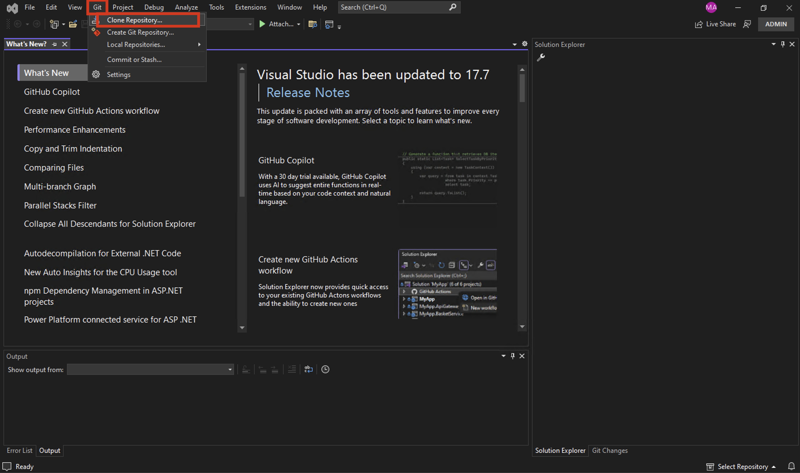
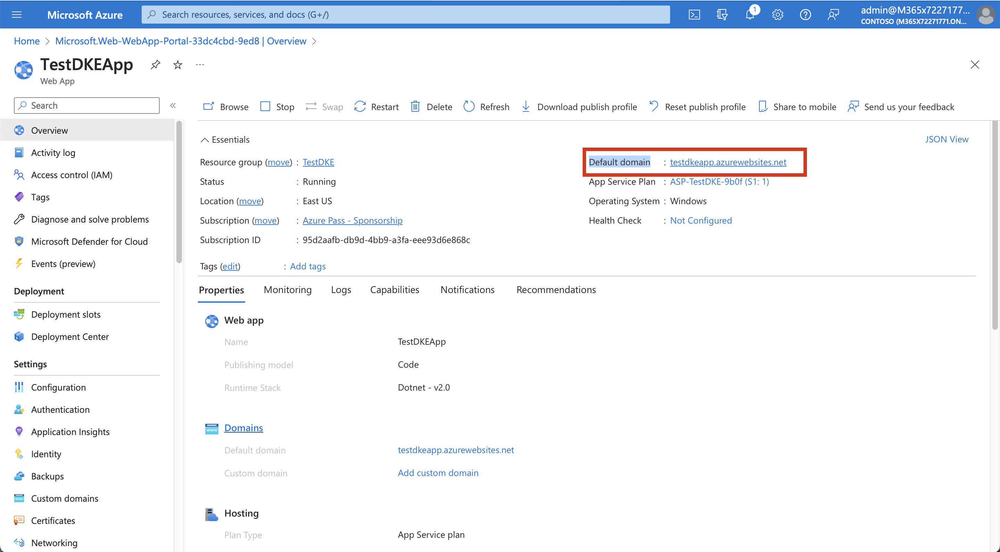
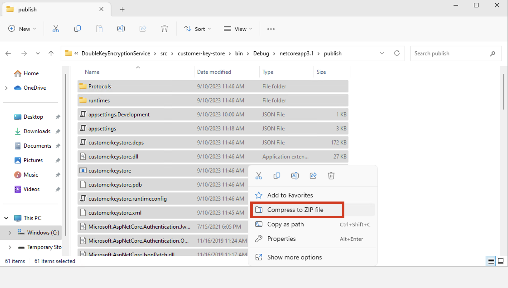
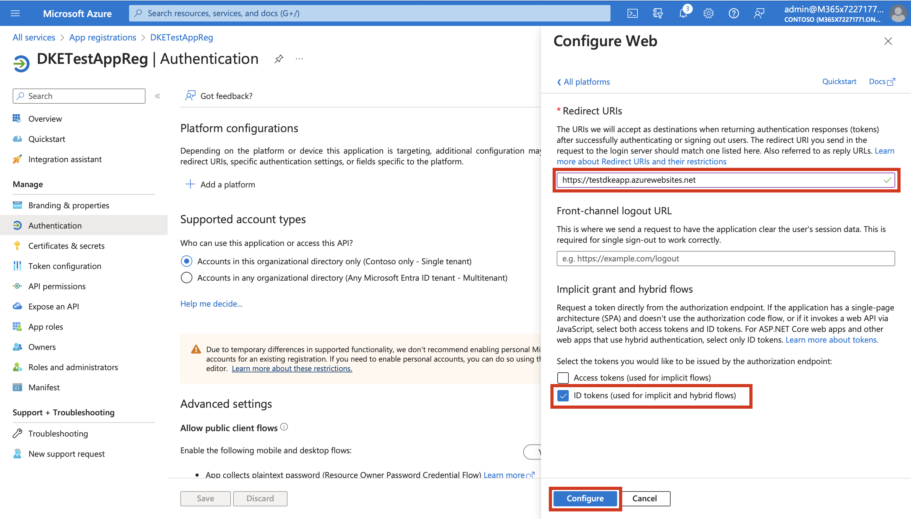

# Lab 6 – Deploy Double Key Encryption

Note: Currently, certain features in this lab are experiencing errors,
preventing its successful execution. We recommend moving on to the next
lab for completion. While you can still proceed with this lab to gain an
overview of DKE, please note that the key store registration feature is
temporarily unavailable. We appreciate your understanding while we work
to resolve this issue.

## Exercise 1: Clone the Double Key Encryption GitHub repository

Microsoft supplies the DKE source files in a GitHub repository. You can
clone the repository to build the project locally for your
organization's use.

1.  On your lab VM open Visual Studio.

2.  Sign in as **MOD Administrator** using the credentials given on the
    home page of your lab environment.

3.  In your browser, go to
    **!!https://github.com/Azure-Samples/DoubleKeyEncryptionService!!**.

&nbsp;

1.  Towards the right side of the screen, select **Code**. Your version
    of the UI might show a **Clone or download** button. Then, in the
    dropdown that appears, select the copy icon to copy the URL to your
    clipboard.

2.  On your VM open **Visual Studio 2022** and **Sign in** using the
    **MOD Administrator**.

3.  Select **Work or school account** and select **Continue**.

4.  Select **Clone a repository**.

5.  Or from the Command bar select **Git \> Clone repository**.

6.  In the **Repository location** text box, paste the URL that you
    copied from Git and select **Clone**.

7.  In **Visual Studio**, go to **Solution Explorer - Views** and select
    **Folder** **View**.

8.  The repository opens and displays the current Git branch at the
    bottom left. The branch should be **main**.

## Exercise 2: Modify application settings

In this task, to deploy the DKE service, you must modify the following
types of application settings:

- Key access settings

- Tenant and key settings

### Task 1: Key access settings

1.  In Visual Studio, expand the folders **src** and
    **customer-key-store** to navigate to **appsettings.json** file.
    Select and open the file.

2.  Scroll to the end of the file and locate the **LDAPPath** setting.

3.  Remove the text “If you use role authorization (AuthorizedRoles)
    then this is the LDAP path.” between the double quotes. Leave the
    double quotes in place. When you're finished, the setting should
    look like this.

> "LDAPPath": ""

4.  Locate the** AuthorizedRoles** setting.

5.  Delete the entire line.

6.  Locate the **AuthorizedEmailAddress** setting.

7.  Add the email addressed of MOD Administrator and Chris Green to the
    **AuthorizedEmailAddress** field. Separate the email addresses with
    double quotes and commas. For example

> **"AuthorizedEmailAddress": \["admin@M365x72271771.onmicrosoft.com", "
> chris@M365x72271771.onmicrosoft.com"\]**

### Task 2: Tenant and key settings

1.  In a browser, to find the tenant ID, go to
    **!!https//www.portal.azure.com!!**.

2.  Sign in with the **MOD Administrator** credentials given on the home
    page of your lab environment

3.  In the search bar, search for and select **Tenant properties**.

4.  Copy the Tenant ID.

5.  Go back to **Visual Studio** and locate the **ValidIssuers**
    setting.

6.  Replace **\<tenantid\>** with your tenant ID.

7.  Select **Save icon** from the command bar.

8.  Keep the file open in Visual Studio and move on to the next
    exercise.

## Exercise 3: Generate test keys

Once you have your application settings defined, you're ready to
generate public and private test keys.

To generate keys:

1.  From the **Windows Start menu**, search for and run the **OpenSSL
    Command Prompt**.

9.  To change to the folder where we want to save the test keys, i.e.
    desktop, run the following command.

> **!!cd desktop!!**

10. Generate the new test key by running the following command.

> **!!openssl req -x509 -newkey rsa:2048 -keyout key.pem -out cert.pem
> -days 365!!**

11. In the **Enter PEM pass phrase**, type **Pa$$.w0rd@MS01**. Type the
    same in **Verifying – Enter PEM pass phrase**.

12. Enter the following information when prompted.

- Country Name (2 letter code) \[AU\]: **!!US!!**

- State or Province Name (full name) \[Some-State\]: **!!Washington!!**

- Locality Name (eg, city) \[\]: **!!Redmond!!**

- Organization Name (eg, company) \[Internet Widgits Pty Ltd\]:
  **!!Contoso!!**

- Organizational Unit Name (eg, section) \[\]: **!!Finance!!**

- Common Name (e.g. server FQDN or YOUR name) \[\]: **Leave blank**

- Email Address \[\]: your **MOD Administrator Email ID**

13. To generate the private key run the following command.

> **!!openssl rsa -in key.pem -out privkeynopass.pem -outform PEM
> -traditional!!**

14. In the **Enter PEM pass phrase**, type **!!Pa$$.w0rd@MS01!!**.

15. To generate the public key run the following command.

> **!!openssl rsa -in key.pem -pubout \> pubkeyonly.pem!!**

16. In the **Enter PEM pass phrase**, type **!!Pa$$.w0rd@MS01!!**.

17. In a text editor, open **pubkeyonly.pem**. Copy all of the content
    in the **pubkeyonly.pem** file, except the first and last lines.

18. Go to Visual Studio Paste it into the **PublicPem** section of the
    **appsettings.json** file. Make sure that it is pasted in a single
    line and not in multiple lines.

19. In a text editor, open **privkeynopass.pem**. Copy all of the
    content in the **privkeynopass.pem** file, except the first and last
    lines.

20. Go to Visual Studio Paste it into the **PrivatePem** section of the
    **appsettings.json** file. Make sure that it is pasted in a single
    line and not in multiple lines.

21. Select **Save icon** from the command bar.

22. In Visual Studio, browse to the **Startup.cs** file. This file is
    located in the DoubleKeyEncryptionService repo you cloned locally
    under DoubleKeyEncryptionService\src\customer-key-store.

23. Locate the following lines:

> \#if USE_TEST_KEYS
>
> \#error !!!!!!!!!!!!!!!!!!!!!! Use of test keys is only supported for
> testing,
>
> DO NOT USE FOR PRODUCTION !!!!!!!!!!!!!!!!!!!!!!!!!!!!!
>
> services.AddSingleton\<ippw.IKeyStore, ippw.TestKeyStore\>();
>
> \#endif

24. Replace these lines with the following text:

> **!!services.AddSingleton\<ippw.IKeyStore, ippw.TestKeyStore\>();!!**

25. Select **Save**.

## Exercise 4: Deploy the DKE service and publish the key store

### Task 1: To create an Azure Web App instance to host your DKE deployment

To publish the key store, you'll create an Azure App Service instance to
host your DKE deployment. Next, you'll publish your generated keys to
Azure.

1.  In your browser, sign in to the **!!https://portal.azure.com!!**,
    and go to **App Services**, from the left navigation bar.

26. Select **Create** \> **Web App**.

27. Enter the following details.

- Subscription – **Azure Pass – Sponsorship**

- Resource Group – **Create new \> !!TestDKE!! \> Ok**

- Name – **!!TestDKEAppXX!!** (Replace XX with a unique number)

- Publish – **Code**

- Runtime stack –**.NET 7 (STS)**

28. At the bottom of the page, select **Review + create**.

29. Select **Create**.

30. Once the deployment is complete select **Go to resources**.

31. Note and copy the **Default domain**. The prefix to
    “.**azurewebsites.net**” will be your **WebAppInstanceName**. Save
    this value in notepad. You will be using it later in the next
    exercise.

32. In Visual Studio, browse to the **appsettings.json** file. This file
    is located in the DoubleKeyEncryptionService repo you cloned locally
    under DoubleKeyEncryptionService\src\customer-key-store.

33. Find **JwtAudience** field and replace its value with your **Default
    domain**.

34. Select **Save.**

### Task 2: Publish via ZipDeployUI 

1.  Go
    to **!!https://\<WebAppInstanceName\>.scm.azurewebsites.net/ZipDeployUI!!**.

> For example: **https://testdkeapp.scm.azurewebsites.net/ZipDeployUI**

35. Run **PowerShell** as an administrator.

36. Find and copy the path to
    the **customer-key-store\src\customer-key-store** folder, and verify
    that this folder contains the **customerkeystore.csproj** file.

37. In PowerShell navigate to
    **customer-key-store\src\customer-key-store** using cd command. For
    example – **cd
    C:\Users\Admin01\source\repos\DoubleKeyEncryptionService\src\customer-key-store**

38. Run the command – **!!dotnet publish!!**

39. You can see a path to the publish directory.

40. Go to this Path in your folder explorer and send all files in the
    publish directory to a .zip file. When creating the .zip file, make
    sure that all files in the directory are at the root level of the
    .zip file. Name the folder as **publish**.

41. Drag and drop the .zip file you create to the ZipDeployUI site you
    opened earlier.

42. DKE is deployed and you can browse to the test keys you've created.

## Exercise 5: Register your key store

The following steps enable you to register your DKE service. Registering
your DKE service is the last step in deploying DKE before you can start
creating labels.

To register the DKE service:

1.  In your browser, go to **https://portal.azure.com/**, and go
    to **All Services.**

2.  Go to **Identity** and select **App Registrations**.

43. Select **New registration**.

44. Enter **!!DKETestAppReg!!** name.

45. Under Supported account types select—**Accounts in this
    organizational directory only (Contoso only – Single tenant)**—from
    the options displayed.

46. At the bottom of the page, select **Register** to create the new App
    Registration.

47. In your new App Registration, in the left pane, under **Manage**,
    select **Authentication**.

48. Select **Add a platform** under **Platform configurations**.

49. On the **Configure platforms** popup, select **Web**.

50. Under **Redirect URIs**, enter **Default domain** that you noted in
    **Exercise 4 – Task 1**, as **URI**.

> For example: **https://testdkeapp.azurewebsites.net**

51. Under **Implicit grant and hybrid flows**, select the **ID
    tokens** checkbox. Select **Configure**.

52. On the left pane, select **Expose an API**, next to **Application ID
    URI** select **Add**.

53. Replace the default value and enter your **Default domain**, and
    then select **Save**.

Note: Usually you should be able proceed with adding the URI but
currently the feature displays an unknown error. Hence we will not be
able to proceed further.

54. Still on the **Expose an API** page, in the **Scopes defined by this
    API** area, select **Add a scope**. In the new scope.

- Define the scope name as **user_impersonation**.

- Select the administrators and users who can consent.

- Define any remaining values required.

- Select **Add scope**.

- Select **Save** at the top to save your changes.

55. Still on the **Expose an API** page, in the **Authorized client
    applications** area, select **Add a client application**.

> In the new client application:

- Define the Client ID as d3590ed6-52b3-4102-aeff-aad2292ab01c. This
  value is the Microsoft Office client ID, and enables Office to obtain
  an access token for your key store.

- Under **Authorized scopes**, select the **user_impersonation** scope.

- Select **Add application**.

- Select **Save** at the top to save your changes.

- Repeat these steps, but this time, define the client ID
  as c00e9d32-3c8d-4a7d-832b-029040e7db99. This value is the Azure
  Information Protection unified labelling client ID.

If the registration completes successfully, we can create the
Sensitivity labels using Double key Encryption.
