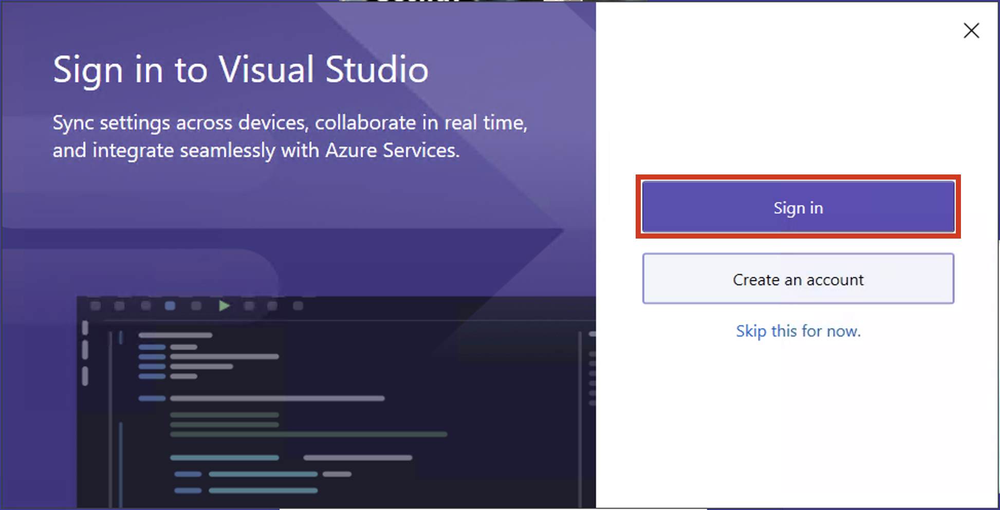

# Lab 6 – Configuring Insider Risk Management

## Objective:

In this lab we will learn how to configure Insider Risk Management using
the Insider Risk Management Policies. We will use the Sensitive Info
Types that we created in Lab 2 and DLP policies that we created in Lab 4
to create policies which will secure the organisation against risky
browser usage or any data theft or leaks.

While logging in the VM devices you will use the Azure AD credentials of
the respective users of the VMs throughout Exercises. Use the following
credentials:

Pattis-Device

pattif@WWLxXXXXXX.onmicrosoft.com

User password

Adeles-Device

adelev@WWLxXXXXXX.onmicrosoft.com

User password

Christies-Device

christies@WWLxXXXXXX.onmicrosoft.com

User password

## Exercise 1: Create Insider Risk Management policies.

### Prerequisites

#### Step 1 – Add users to Insider risk management role group

1.  If the Microsoft Purview portal is open continue to step 2,
    otherwise, open the **+++https://purview.microsoft.com+++** and log
    in with the **MOD Administrator** credentials.

2.  In the navigation select **Settings**, and select **Role groups**
    under **Role groups**, select **Insider Risk Management**. Then
    select **Edit**. On the side pane, again select **Edit**.

3.  On the **Edit Members of the role group** page, select **Choose
    users**.

4.  Select the checkbox near **Megan** and **Alex**. Then
    choose **Select**.

5.  Then select **Next**.

6.  Select **Save** to add the users to the role group.

7.  Select **Done** to complete the steps.

#### Step 2 – Enable insider risk analytics insights

1.  In the Microsoft Purview portal. Navigate to **Settings**, go
    to **Insider risk management**. Go to **Analytics**, and enable the
    radio button, and click on **Save**.

#### Step 3 – Onboarding a device

In this deployment scenario, you'll onboard devices that haven't been
onboarded yet, and you just want to detect insider risk activities on
Windows 10 devices.

1.  Connect to **Pattis-Device** via RDP, click on windows and search
    for **Windows Security**.

2.  Click on **settings** icon in the bottom left.

3.  Click on **About**.

4.  The version number is listed under Antimalware Client Version. The
    version number is listed under Antimalware Client Version. Check
    that Antimalware Client Version **is 4.18.2110** or newer, if not
    continue to next step or if it is continue to step 9.

5.  On the VM, click on windows and search for **Check for Updates**.

6.  Click on **Download now**, or **Install now**.

7.  Once the install is completed, go again to windows security again
    and check that Antimalware Client Version is **4.18.2110** or newer.
    If not, repeat the steps 5 and 6, till the VM is updated.

8.  Close security center and update center. End the RDP connection for
    now.

9.  Repeat the steps from 1 to 7 to
    update **Adeles-Device** and **Christies-Device**.

10. Sign in to +++**https://security.microsoft.com/+++** using
    your **MOD Administrator** account on your Lab VM.

11. Select **Settings** \> **Device** **onboarding**.

12. Click on **Turn on Device onboarding**.

13. From the **settings** \> **Device onboarding** \> **Onboarding**.
    Click on **Download package**.

14. Once downloaded, connect to **Pattis-Device** via RDP and copy the
    file to the desktop of **Pattis-Device**.

15. Right click the file and **Extract all…** .

16. Once done open the folder and run the file
    with **Administrator** rights.

17. Click on **More info**.

18. Click on **Run anyway**.

19. In the Command Prompt, press **Y** and press enter to confirm and
    continue when prompted.

20. You will receive a message that the device is onboarded. In the
    Command Prompt once you get the message, **Press any key to continue
    . . .**, press any key.

21. Once the Command Prompt is closed, open Command Prompt in
    administrator mode to run a detection test and at the prompt, copy
    and run the command below. The Command Prompt window will close
    automatically.

**+++powershell.exe -NoExit -ExecutionPolicy Bypass -WindowStyleHidden $ErrorActionPreference= 'silentlycontinue';(New-ObjectSystem.Net.WebClient).DownloadFile('http://127.0.0.1/1.exe','C:\test-WDATP-test\invoice.exe');Start-Process 'C:\test-WDATP-test\invoice.exe'+++**

22. Close the VM connection.

23. If the device onboarding is successful, you can go to
    the **Microsoft 365 Defender** portal that we left open in the
    browser on Lab VM and you will see that the detection test is marked
    as completed and a new alert appears in few minutes.

24. Now copy the file we downloaded in step 13, and repeat the steps 15
    to 21 for the VMs — **Connies-Device** and **Chriss-Device**,
    respectively to onboard them as Devices in **Microsoft 365
    Defender** portal.

25. Open the **+++https://purview.microsoft.com+++** and log in with the
    username **<pattif@WWLxXXXXXX.onmicrosoft.com>** and the User
    password. (replace WWLxXXXXXX with your tenant prefix given on the
    resources tab).

26. Open the **settings** by clicking on the settings in the navigation
    and choose **Devices Onboarding** \> **Devices**.

**Note:** While it usually takes about 60 seconds for device onboarding
to be enabled, please allow up to 30 minutes.

27. You will be able to check the **Devices** list. The list will be
    empty until you onboard devices, once done, you will be able to see
    your VMs listed as the onboarded device.

### Task 1: Creating an organisation wide policy to detect and score Risky Browser Usage

#### Step 1 – Create a new policy

1.  If you closed the browser window in the previous task, open
    the **+++https://purview.microsoft.com+++** and log in with the
    username **pattif@WWLxXXXXXX.onmicrosoft.com** and the User
    password. (replace WWLxXXXXXX with your tenant prefix given on the
    resources tab).

2.  Go to **Insider Risk Management** and select the **Policies** tab.
    Select **Create policy** to open the policy wizard.

3.  On the Choose a policy template page, choose Risky browser usage
    (preview), under Risky browser usage (preview).

4.  Make sure that all the prerequisites are met.

5.  Select **Next** to continue.

6.  On the **Name and description** page, complete the following fields:

    - Name (required): Risky usage of browser

    - Description (optional): This is a test policy for the risky
      browser usage.

7.  Select **Next** to continue.

8.  On the Choose users and groups page, select Include all users and
    groups. Select Next to continue.

9.  On the Decide whether to prioritize page, select I don't want to
    specify priority content right now (you'll be able to do this after
    the policy is created). Select Next to continue.

10. On the Triggers for this policy page, select Turn on indicators.

11. On Choose indicators to turn on, select Select all under Risky
    browsing indicators (preview), and uncheck rest of the boxes.

12. Scroll down and select **Save**.

13. On Triggers for this policy, under Select which activities will
    trigger this policy. Select all the options and click on Next.

14. On Triggering thresholds for this policy page, select Use custom
    thresholds (Recommended), change all the thresholds to 1 per day and
    then select Next.

15. On **indicators** page, select **Next**.

16. On Decide whether to use default or custom indicator thresholds,
    select Use default thresholds for all indicators, then select Next.

17. On Review settings and finish, select Submit.

18. On Your policy was created, select Done.

19. Keep the tab open and continue to the next task.

#### Step 2 – Score the policy

1.  Click on the new policy named Risky usage of browser. Select Start
    scoring activity for users.

2.  In the Reason field in the Add users to multiple policies pane,
    type Testing the policy.

3.  In the This should last for (choose between 5 and 30 days) field,
    select 10 days.

4.  Use the Search user to add to policies field. Add Brooke, Connie,
    and Chris. Then click on Start scoring activity.

5.  Once you get the confirmation that you have started **Scoring
    activity for 3 users**, click **Close**.

### Task 2: Data theft by departing users

#### Step 1 – Create a new policy

1.  If you closed the browser window in the previous task, open
    the **+++https://purview.microsoft.com+++** and log in with the
    username **pattif@WWLxXXXXXX.onmicrosoft.com** and the User
    password. (replace WWLxXXXXXX with your tenant prefix given on the
    resources tab).

2.  Go to **Insider Risk Management** and select the **Policies** tab.
    Select **Create policy** to open the policy wizard.

3.  On the Choose a policy template page, choose Data theft by departing
    users, under Data theft. Select Next to continue.

4.  On the **Name and description** page, complete the following fields:

    - Name (required): Data theft by a user

    - Description (optional): This is a test policy forthe preventing
      data theft.

5.  Select **Next** to continue.

6.  On the Choose users and groups page, select Include all users and
    groups. Select Next to continue.

7.  On the Decide whether to prioritize page, select I want to specify
    priority content. Select the check box for Sensitivity
    labels and Sensitive info types. Select Next to continue.

8.  On the Sensitivity labels to prioritize page, select Add or edit
    sensitivity labels. On the flyout pane, select Internal/Employee
    data (HR) and select Add. Then click Next.

9.  On the Sensitive info types to prioritize page, select Add or edit
    sensitive info types. On the flyout pane, search for and
    select Credit Card Number, Contoso Employee ID and Contoso Employee
    EDM. Select Add. Then click Next.

10. On Decide whether to score only activity with priority content,
    select Get alerts for all activity. Select Next.

11. On triggers for this policy page, select the default and then
    select Next.

12. On **Indicators** page, select **Turn on indicators** from the
    prompt.

13. Select Select all under Office indicators and click Save.

14. Select all the options and click on **Next**.

15. On **Detection options** page, select the default and then
    select **Next**.

16. On **indicators** page, select **Next**.

17. On Decide whether to use default or custom indicator thresholds,
    select Customise thresholds, use 1, 2, and 3 events for each stage
    respectively then select Next.

18. On Review settings and finish, select Submit.

19. On Your policy was created, select Done.

20. Keep the tab open and continue to the next task.

#### Step 2 – Score the policy

1.  Click on the new policy named Data theft by a user. Select Start
    scoring activity for users.

2.  In the Reason field in the Add users to multiple policies pane,
    type Testing the policy.

3.  In the This should last for (choose between 5 and 30 days) field,
    select 10 days.

4.  Use the Search user to add to policies field. Add Peter. Then click
    on Start scoring activity.

5.  Once you get the confirmation that you have started **Scoring
    activity for 1 users**, click **Close**.

### Task 3: Data leaks by users

#### Step 1 – Create a new policy

1.  If you closed the browser window in the previous task, open
    the **+++https://purview.microsoft.com+++** and log in with the
    username **pattif@WWLxXXXXXX.onmicrosoft.com** and the User
    password. (replace WWLxXXXXXX with your tenant prefix given on the
    resources tab).

2.  Go to **Insider Risk Management** and select the **Policies** tab.
    Select **Create policy** to open the policy wizard.

3.  On the **Choose a policy template** page, choose **Data leaks**,
    under **Data leaks**. Select **Next** to continue.

4.  On the **Name and description** page, complete the following fields:

    - Name (required): Data leaks by a user

    - Description (optional): This is a test policy forthe preventing
      data leaks.

5.  Select **Next** to continue.

6.  On the Choose users and groups page, select Include all users and
    groups. Select Next to continue.

7.  On the Decide whether to prioritize page, select I want to specify
    priority content. Select the check box for SharePoint
    sites, Sensitivity labels and Sensitive info types. Select Next to
    continue.

8.  On the SharePoint sites to prioritize page, select Add or edit
    SharePoint sites. On the flyout pane,
    select **https://wwlxXXXXXX.sharepoint.com/sites/ContosoWeb1** and
    select Add. Then click Next.

9.  On the Sensitivity labels to prioritize page, select Add or edit
    sensitivity labels. On the flyout pane, select Internal/Employee
    data (HR) and select Add. Then click Next.

10. On the Sensitive info types to prioritize page, select Add or edit
    sensitive info types. On the flyout pane, search for and
    select Credit Card Number, Contoso Employee ID and Contoso Employee
    EDM. Select Add. Then click Next.

11. On Decide whether to score only activity with priority content,
    select Get alerts for all activity. Select Next.

12. On triggers for this policy page, select Radio button near User
    performs an exfiltration activity. Under select which activities
    will trigger this policy, select all the available
    options especially Download content from SharePoint. and then
    select Next.

13. On Triggering thresholds for this policy, select Use custom
    thresholds. Set every threshold to 1 and select Next.

14. Select the default settings on the **Indicators** page and
    select **Next**.

15. On Decide whether to use default or custom indicator thresholds,
    select Customise thresholds, use 1, 2, and 3 events for each stage
    respectively then select Next.

16. On Review settings and finish, select Submit.

17. On Your policy was created, select Done.

18. Keep the tab open and continue to the next task.

#### Step 2 – Score the policy

1.  Click on the new policy named Data leaks by a user. Select Start
    scoring activity for users.

2.  In the Reason field in the Add users to multiple policies pane,
    type Testing the policy. In the This should last for (choose between
    5 and 30 days) field, select 10 days. Use the Search user to add to
    policies field. Add Brooke, Connie, and Chris. Then click on Start
    scoring activity.

3.  Once you get the confirmation that you have started **Scoring
    activity for 3 users**, click **Close**.

You have successfully created the Insider risk management policies.

## Summary:

In this lab we explored setting up Insider Risk Management from
end-to-end. With your own subscription and licenses, you can also use
this lab guide to create an Azure setup that can also be used to create
various alerts (which includes sending emails with restricted data,
which is not possible from a trial subscription) for the Insider Risk
management policies which you can use to explore the Adaptive Protection
feature on Purview.
