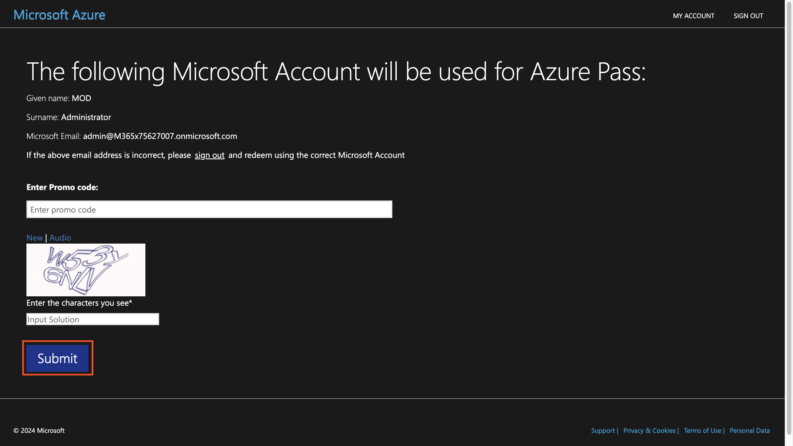
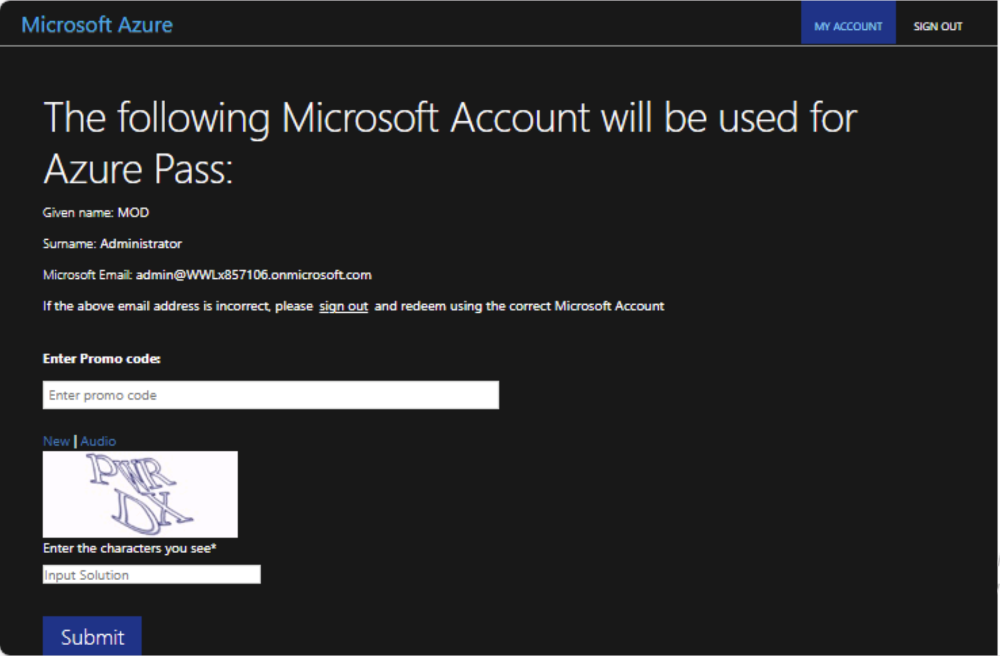
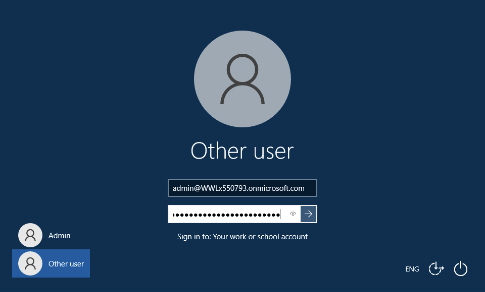

# Lab 7 – Configuring Communication Compliance

## Objective:

In this lab you will configure a compliance policy to detect any
sensitive information being communicated by the users in your
organisation. You will use the sensitive info types created in the
earlier lab, to detect the employee health data or employee IDs being
communicated through Emails.

## Exercise 1 – Enabling permissions for communication compliance

In this task you will assign users to specific role groups to segment
communication compliance access and responsibilities among different
users in your organization.

1.  If the Microsoft Purview portal is open continue to step 2,
    otherwise, open the **+++https://purview.microsoft.com+++** and log
    in with the **MOD Administrator** credentials.

2.  In the navigation select **Settings**, and select **Role groups**
    under **Role groups**, select **Communication Compliance**. Then
    select **Edit**. On the side pane, again select **Edit**.

3.  On the **Edit members of the role group** select **Choose Users**.

4.  Make sure to select **MOD Administrator**, **Megan Bowen**, and
    **Patti Fernandez**. Then choose **Select**.

5.  Select **Next**.

6.  Select **Save** to add the users to the role group.
    Select **Done** to complete the steps.

## Exercise 2 – Setting up groups for communication compliance

In the policy, you'll use email addresses to identify individuals or
groups of people. To simplify your setup, you can create groups for
people who have their communication reviewed and groups for people who
review those communications.

You can use PowerShell to configure a distribution group for a global
communication compliance policy for the assigned group. This enables you
to detect messages for thousands of users with a single policy and keep
the communication compliance policy updated as new employees join your
organization.

1.  Open **PowerShell** in administrator mode.

2.  Enter the following cmdlet to use the **Exchange Online
    PowerShell** module and connect to your tenant:

**+++Connect-ExchangeOnline+++**

3.  When the **Sign in** window is displayed, sign in as **MOD
    Administrator**.

4.  Create a dedicated distribution group for your global communication
    compliance policy with the following properties:

    - **MemberDepartRestriction = Closed**. Ensures that users can't
      remove themselves from the distribution group.

    - **MemberJoinRestriction = Closed**. Ensures that users can't add
      themselves to the distribution group.

    - **ModerationEnabled = True**. Ensures that all messages sent to
      this group are subject to approval and that the group isn't being
      used to communicate outside of the communication compliance policy
      configuration.

**+++New-DistributionGroup -Name "Communication Compliance Group
Contoso" -Alias "CCG_Contoso" -MemberDepartRestriction
'Closed' -MemberJoinRestriction 'Closed' -ModerationEnabled $true+++**

**Note:** You can add an **Exchange Custom Attribute** as in
the **following command**to track users added to the communication
compliance policy in your organization.

**+++Set-DistributionGroup -Identity "Communication Compliance Group
Contoso"-CustomAttribute1 "MonitoredCommunication"+++**

5.  Run the following PowerShell script on a recurring schedule to add
    users to the communication compliance policy:

**+++$Mbx = (Get-Mailbox -RecipientTypeDetails UserMailbox -ResultSize
Unlimited -Filter {CustomAttribute9 -eq $Null})**

**$i = 0**

**ForEach ($M in $Mbx)**

**{**

**Write-Host "Adding" $M.DisplayName**

**Add-DistributionGroupMember -Identity "Communication Compliance Group
Contoso" -Member $M.DistinguishedName -ErrorAction SilentlyContinue**

**Set-Mailbox -Identity $M.Alias -CustomAttribute1
"MonitoredCommunication"**

**$i++**

**}**

**Write-Host $i "Mailboxes added to supervisory review distribution
group." +++**

**Note:** This script is supposed to be run after every particular
interval. As of now you will be able to see the Distribution list under
Active teams & Groups in Microsoft 365 admin center.

If you click on the group name, you will be able to see all the users
listed under members tab.

## Exercise 3 – Creating a communication compliance policy

1.  If the Microsoft Purview compliance portal is open continue to step
    2, otherwise, open the **+++https://purview.microsoft.com+++** and
    log in as **MOD Administrator**.

2.  In the Microsoft Purview portal, select **Settings** \>
    **Communication compliance**.

3.  Select from the sub-navigation, select **Policy**. Then select
    **Create policy**.

4.  Select **Custom policy** from the drop down.

5.  On the Name your DLP policy page, type **+++My first communication
    compliance policy+++** in the **Name** field and **+++This is a
    policy to test communication compliance+++** in
    the **Description** field. Select **Next**.

6.  On the **Choose supervised users and reviewers** page, keep rest of
    the default settings and under reviews add **Patti Fernandez**. Then
    click on **Next**.

7.  On the **communications** page, check all the boxes
    under **Microsoft 365 locations** and click on **Next**.

8.  On the **Choose conditions and review percentage**, select **Add
    condition**, from the drop down, select **Content contains any of
    these sensitive info types**.

9.  In the **Content contains any of these sensitive info types** box,
    select **Add**, click on **Sensitive info types**, and search
    for **contoso**. Check the boxes for all the sensitive info types we
    created in earlier labs. Then click **Add**

10. On **Choose conditions and review percentage**, check the box
    beside **Use OCR to extract text from images**, set **Review
    percentage to 100%**, and then click on **Next**.

11. On **Review and finish** page, select **Create policy**.

12. The **Your policy was created** page is displayed with guidelines on
    when policy will be activated and which communications will be
    captured.

## Exercise 4 – Editing a communication compliance policy

1.  If the Microsoft Purview compliance portal is open continue to step
    2, otherwise, open the **+++https://purview.microsoft.com+++** and
    log in as **MOD Administrator**.

2.  In the Microsoft Purview portal, go to **Settings** \>
    **Communication compliance** \> **Policies**, select the three dots
    near **My first communication compliance policy** and
    select **Edit**.

3.  Leave the **Name and describe your policy** blank and
    click **Next**.

4.  On **Choose supervised user and reviewers** and under **Supervised
    users and groups**, select the **Select users** button.

5.  In the **Start typing to find users or groups**, search
    for **Communication** and select **Communication Compliance Groups
    Contoso**.

6.  On Choose supervised user and reviewers under Reviewers add MOD
    Administrator to the Reviewers.

7.  Select **Next** till you reach **Review and finish** page.

8.  Click on **Save**.

## Exercise 5 – Creating notice templates and configure user anonymization

1.  In the Microsoft Purview portal, select Settings from the top right
    corner and the select **Communication compliance**.

2.  Select the **Privacy** tab. To enable anonymization, make
    sure **Show anonymized versions of usernames** is selected.
    Select **Save**.

3.  Navigate to the **Notice templates** tab and then select **Create
    notice template**.

4.  On the **Modify a notice template** page, complete the following
    fields:

    - Template name (required): **+++Sample Notice+++**

    - Send from (required): Select **Patti Fernandez** by
      typing **Patti** and selecting the name from the drop down.

    - Cc (optional): Select **MOD** **administrator** by
      typing **MOD** and selecting the name from the drop down.

    - Subject (required): **+++Your communication violets company
      Communication compliance policy.+++**

    - Message body (required): **+++Please note this for future
      reference and provide an acceptable justification for your current
      communication. +++**

5.  Select **Create** to create and save the notice template.

## Exercise 6 – Testing your communication compliance policy

In the trial account you will not have the privilege to send any email
but you can check out the following steps to understand how to test the
policy when you have your own licenses. You can perform steps but your
mail will not be able to reach the receiver from your current tenant.

1.  Open outlook by going
    to **+++https://outlook.office365.com/mail/+++**and sign in with the
    username **+++adelev@WWLxXXXXXX.onmicrosoft.com+++** and the User
    Password.

2.  Send an email to your personal email account with the following
    message body.

Message body: **+++Employee Patti Fernandez EMP123456 is on absence
because of the flu/influenza+++**

**Note** Email messages can take approximately 24 hours to fully process
in a policy. Communications in Microsoft Teams, Yammer, and third-party
platforms can take approximately 48 hours to fully process in a policy.

Sign in to **+++https://purview.microsoft.com/+++** as **Patti
Fernandez**. Navigate to **Communication compliance** \> **Alerts** to
view the alerts for your policies after 24 hours.

**Summary:**

In this lab we learned how to enable the permissions for communication
compliance, create the policies, manage them and then create notice
templates and configure user anonymization.
