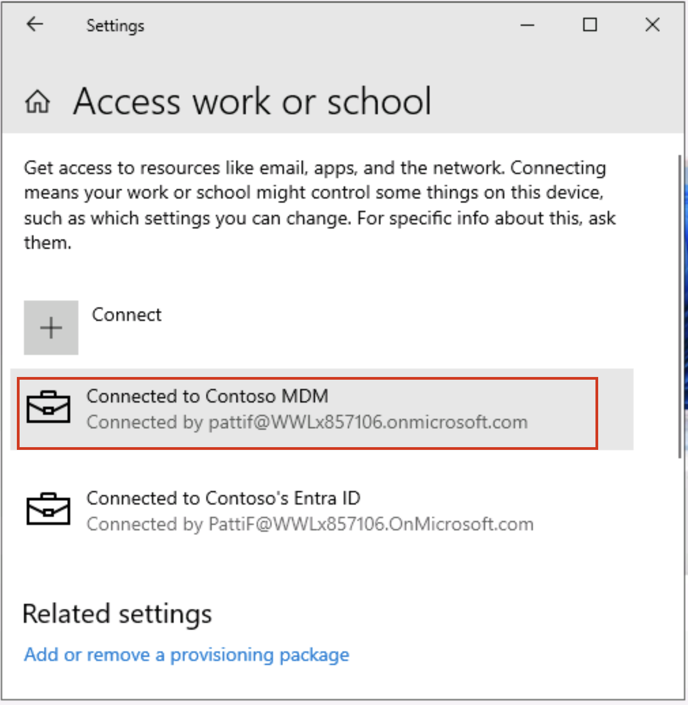

# Lab 7 – Configuring Insider Risk Management

## Objective:

In this lab we will learn how to configure Insider Risk Management using
the Insider Risk Management Policies. We will use the Sensitive Info
Types that we created in Lab 2 and DLP policies that we created in Lab 5
to create policies which will secure the organisation against risky
browser usage or any data theft or leaks.

To do this we will create an infrastructure in Azure that will represent
the devices in an organisation. We will learn how to onboard those
devices in Azure AD and Intune, and install an MDM agent on them, so
that they can be used to get the alerts from those machines.

## Exercise 1: Synchronize the VM clock

1.  After logging into the VM, select the windows icon. Then search
    for **Date and time**, and select **Date and time settings**.


2.  On the Settings screen that opens up, click on the **Sync
    now** under Additional settings.


3.  This takes care of synchronizing the time just in case the automatic
    synchronization does not work.


<<<<<<< Updated upstream
<<<<<<< Updated upstream
### Task 1: Redeem the Azure Pass

**Note**: - You may be asked for authentication while performing this Task. Please download Microsoft Authenticator on your mobile device or add your phone number as the authentication method when asked. You will be guided through the steps given on your authentication setup wizard, when asked for authentication.

#### Redeeming a Microsoft Azure Pass Promo Code

1.  Open a browser and navigate to: ```www.microsoftazurepass.com ```

It is recommended you close all browsers and open a new In-Private
Browser session. Other log-ins can persist and cause errors during the
activation step.

2.  Click the **Start** button to get started.


3.  Enter your Office 365 tenant credentials and select Sign In.


4.  Click **Confirm Microsoft Account** if the correct email address is
    listed.


5.  Enter your **Azure Pass** promo code in the Enter Promo code box and
    click “**Claim Promo Code**”.


6.  It may take up to 5 minutes to process the redemption.


#### Activate your subscription

1.  When the redemption process is completed, it will redirect to the
    sign up page.

2.  Enter your account information and click **Next**.


3.  Click the agreement check box and click the Sign up button.

4.  It may take a few minutes to process the request.


5.  Your **Azure subscription** is ready


### Task 2: Register your lab VM in Azure AD (Now Microsoft Entra ID)

To open any VM that is registered in Azure AD, we need to register our
device/VM in Microsoft Entra ID. So, we will register our Lab VM to the
Contoso’s Entra ID.

1.  Open windows **Setting** on your VM.


2.  Go to **Accounts** \> **Access work or school**.


3.  Under **Access work or school account**, click on **Connect**.


4.  In the **Set up a work or school account** prompt, click on **Join
    this device to Microsoft Entra ID**.


5.  In the sign in prompt, sign in with **MOD
    Administrator** credentials given on the resources tab of your lab
    environment. 


6.  Press **Join** in the prompt **Make sure this is your organisation**.


7.  Once done you will see a confirmation window **You’re all set!**.
    Click on **Done**.

8.  Now click on the windows symbol on your VM. Select the
    user **Admin** and select **Sign out**.


9.  On the user screen select **Other user**.


10. Enter your O365 credentials given on the home page of your lab
    environment and log into the VM as **MOD Administrator**.


11. All the following tasks should be performed under this user only. If
    not, you will not be able to log into the VMs we will be creating in
    the following exercises.

### Task 3: Create VMs to replicate an organization’s Structure.

Note: The configurations in the screenshots may not be exactly the same
as some features keep on updating in Azure. Please follow the
instructions thoroughly and refer to the screenshots for finding the
buttons or the areas of interest.

1.  On the **Azure portal ( ```https://portal.azure.com ```)** menu or
    from the **Home** page, select **Create a resource**.

2.  Select **Create** under **Virtual Machines**.


3.  Enter these values for the virtual machine:

| Setting                 | Value                                                                                                                                       |
|-------------------------|---------------------------------------------------------------------------------------------------------------------------------------------|
| Resource group          | Click on **Create new** > ```ContosoDevices``` > Click on **Ok**                                                                        |
| Virtual machine name    | ```Pattis-Device```                                                                                                                     |
| Region                  | **(Asia Pacific) Australia EastUS** (You can use any other region as per availability of the VM images like DS1 or DS2 variants)            |
| Security                | Standard                                                                                                                                    |
| Image                   | Windows 10 Pro, Version 22H2 – x64 Gen2                                                                                                     |
| Administrator user name | ```Admin01```                                                                                                                               |
| Password                | ```Pa$$.w0rd@123```                                                                                                                         |


4.  Make sure that under Licenses the check box besides Would you like
    to use an existing Windows Server license? is checked.


5.  Accept the other defaults and select **Review + create**.


6.  Review the settings on the summary page, and then select **Create**.


7.  Go to the newly created machine, **Pattis-Device**,
    select **Connect** and then **RDP** and download the RDP file.

8. Create 2 other VMs using the same steps and the following
    information.

| Setting                 | Value                                                                                                                                       |
|-------------------------|---------------------------------------------------------------------------------------------------------------------------------------------|
| Resource group          | Select **ContosoDevices**                                                 						                        |
| Virtual machine name    | ```Adeles-Device```                                                                                                                     |
| Region                  | **(Asia Pacific) Australia EastUS** (You can use any other region as per availability of the VM images like DS1 or DS2 variants)            |
| Security                | Standard                                                                                                                                    |
| Image                   | Windows 10 Pro, Version 22H2 – x64 Gen2                                                                                                     |
| Administrator user name | ```Admin01```                                                                                                                               |
| Password                | ```Pa$$.w0rd@123```                                                                                                                         |

| Setting                 | Value                                                                                                                                       |
|-------------------------|---------------------------------------------------------------------------------------------------------------------------------------------|
| Resource group          | Select **ContosoDevices**                                                          						                |
| Virtual machine name    | ```Christie-Device```                                                                                                                   |
| Region                  | **(Asia Pacific) Australia EastUS** (You can use any other region as per availability of the VM images like DS1 or DS2 variants)            |
| Security                | Standard                                                                                                                                    |
| Image                   | Windows 10 Pro, Version 22H2 – x64 Gen2                                                                                                     |
| Administrator user name | ```Admin01```                                                                                                                               |
| Password                | ```Pa$$.w0rd@123```                                                                                                                         |

9. You can open the RDP files and use the following local credentials
    to log in sign in to these Virtual Machines.

    - User Name: ```Admin01```

    - Password: ```Pa55.w0rd@123```

### Task 4: Enrol the VMs in Azure AD as different users

1. Open the RDP file for **Pattis-Device** and log in with the local
    credentials.

2. Open windows **Setting** on your newly created VM named **Patti’s**
    **Device**.


3. Go to **Accounts** \> **Access work or school**.


4. Under **Access work or school account**, click on **Connect**.


5. In the **Set up a work or school account** prompt, click on **Join
    this device to Microsoft Entra ID**.


6. In the sign in prompt, sign in with the
    username **pattif@{TENANTPREFIX}.onmicrosoft.com** and the User
    password. (replace {TENANTPREFIX} with your tenant prefix given on the
    resources tab).

7. Press Join in the prompt **Make sure this is your**
    **organisation**.


8. Once done you will see a confirmation window **You’re all set!**.
    Click on **Done**.


9. Once again near **Access work or school**, click on **Connect**.


10. In the Set up a work or school account prompt, sign in with
    username **pattif@{TENANTPREFIX}.onmicrosoft.com** and the User
    password. (replace {TENANTPREFIX} with your tenant prefix given on the
    resources tab).

11. It will take a couple of minutes to sign in.


12. You will get a prompt saying, **Setting up your account**.
    Press **Got it**.


13. On your **Settings \>Accounts \>Access work or school** page, you
    will see Patti Fernandez’s account connected twice. Expand the one
    that says **Connected to Contoso MDM.**



14. Click on **Info**.


15. On the **Settings** \>**Accounts** \> **Access work or school** \> **Managed by Contoso**, under **Device sync status**, click
    on **Sync**.


16. Once done close the **Settings** and from the start
    window, **restart** the PC. Please make sure you do not shut it
    down.


17. Open the RDP file again. Click on **More choices**.


18. Click on **Use a different account**.


19. Sign in with username **pattif@{TENANTPREFIX}.onmicrosoft.com** and the
    User password. (replace {TENANTPREFIX} with your tenant prefix given on
    the resources tab). If asked for the confirmation, click on **Yes**.

20. Open the RDP file of Adele’s device and following the same 1 t0 19
    steps as we did for Patti’s device, enrol the device in Microsoft
    Entra ID. In the sign in prompt, sign in with the
    username **adelev@{TENANTPREFIX}.onmicrosoft.com** and the User password
    (replace {TENANTPREFIX} with your tenant prefix given on the resources
    tab).

21. Open the RDP file of Christie’s device and following the same 1 t0
    19 steps as we did for Patti’s device, enrol the device in Azure AD.
    In the sign in prompt, sign in with the
    username **christiec@{TENANTPREFIX}.onmicrosoft.com** and the User
    password (replace {TENANTPREFIX} with your tenant prefix given on the
    resources tab).

**Note:** Henceforth, while logging in these devices you will use the
Azure AD credentials of the respective users of the VMs throughout
Exercises. Use the following credentials:

Pattis-Device

pattif@{TENANTPREFIX}.onmicrosoft.com

User password

Adeles-Device

adelev@{TENANTPREFIX}.onmicrosoft.com

User password

Christies-Device

christies@{TENANTPREFIX}.onmicrosoft.com

User password

=======
>>>>>>> Stashed changes
=======
>>>>>>> Stashed changes
## Exercise 2: Create Insider Risk Management policies.

### Prerequisites

#### Step 1 – Add users to Insider risk management role group

1.  If the Microsoft Purview portal is open continue to step 2,
    otherwise, open the ```https://purview.microsoft.com ``` and log
    in with the **MOD Administrator** credentials.


2.  In the navigation select **Settings**, and select **Role groups**
    under **Role groups**, select **Insider Risk Management**. Then
    select **Edit**. On the side pane, again select **Edit**


3.  On the **Edit Members of the role group** page, select **Choose
    users**.


4.  Select the checkbox near **MOD Admin**, **Patti**, **Megan** and **Alex**. Then
    choose **Select**.


5. Then select **Next**.


6. Select **Save** to add the users to the role group.


7. Select **Done** to complete the steps.


#### Step 2 – Enable insider risk analytics insights

1.  In the Microsoft Purview portal. Navigate to **Settings**, go
    to **Insider risk management**. Go to **Analytics**, and enable the
    radio button, and click on **Save**.


#### Step 3 – Onboarding a device

In this deployment scenario, you'll onboard devices that hasn't been
onboarded yet, and you just want to detect insider risk activities on
Windows 10 devices.

We need to register our device/VM in Microsoft Entra ID as a prerequisite to creating any Insider Risk Policy.

1.  Open windows **Setting** on your VM.


2.  Go to **Accounts** \> **Access work or school**. On the **Access work or school** page, click on **Connect**.


3.  In the **Set up a work or school account** prompt, click on **Join
    this device to Microsoft Entra ID**.


4.  In the sign in prompt, sign in with **MOD
    Administrator** credentials given on the resources tab of your lab
    environment. 


5.  Press **Join** in the prompt **Make sure this is your organisation**.


6.  Once done you will see a confirmation window **You’re all set!**.
    Click on **Done**.


7.  Again go to **Accounts** \> **Access work or school**. On the **Access work or school** page, click on **Connect**.


8. In the **Set up a work or school account** prompt, use the MOD admin credentials to log in.


9. On the **Setting up your device** page, select **Got it**.


10. Now go to **windows settings** > **Accounts** > **Access work or school** > **Connected to Contoso MDM** > **Info** > **Sync**.


11. Click on the windows symbol on your VM. Select the
    user **Admin** and select **Sign out**.


12.  On the user screen select **Other user**.


13. Enter your O365 credentials given on the home page of your lab
    environment and log into the VM as **MOD Administrator**.


14. Close the windows settings app. Sign in to  ```https://purview.microsoft.com``` using
    your **MOD Administrator** account on your Lab VM.

15. Select **Settings** \> **Device onboarding** > **Devices**.


16. Click on **Turn on Device onboarding**.


17. From the **Settings** \> **Device onboarding** \> **Onboarding**.
    Click on **Download package**.


18. Right click the file and **Extract all…** .


19. Once done open the folder and run the file
    with **Administrator** rights.


20. Click on **More info**.


21. Click on **Run anyway**.


22. In the Command Prompt, press **Y** and press enter to confirm and
    continue when prompted.


23. You will receive a message that the device is onboarded. In the
    Command Prompt once you get the message, **Press any key to continue
    ...**, press any key.

24. Once the Command Prompt is closed, open Command Prompt in
    administrator mode to run a detection test and at the prompt, copy
    and run the command below. The Command Prompt window will close
    automatically.

```powershell.exe -NoExit -ExecutionPolicy Bypass -WindowStyle Hidden $ErrorActionPreference= 'silentlycontinue';(New-ObjectSystem.Net.WebClient).DownloadFile('http://127.0.0.1/1.exe','C:\test-WDATP-test\invoice.exe');Start-Process 'C:\test-WDATP-test\invoice.exe'```


25. Open the **settings** by clicking on the settings in the navigation
    and choose **Devices Onboarding** \> **Devices**.

**Note:** While it usually takes about 60 seconds for device onboarding
to be enabled, please allow up to 30 minutes.

26. You will be able to check the **Devices** list. The list will be
    empty until you onboard devices, once done, you will be able to see
    your VMs listed as the onboarded device.

### Task 1: Creating an organisation wide policy to detect and score Risky Browser Usage

#### Step 1 – Create a new policy

1.  If you closed the browser window in the previous task, open
    the ```https://purview.microsoft.com ``` and log in with the
    Admin credentials.

2.  Go to **Insider Risk Management** and select
    the **Policies** tab. Select **Create policy** to open the policy
    wizard.


3.  On the **Choose a policy template** page, choose **Risky browser usage
    (preview)**, under **Risky browser usage (preview)**.


4.  Make sure that all the prerequisites are met.


5.  Select **Next** to continue.


6.  On the **Name and description** page, complete the following fields:

    - Name (required): ```Risky usage of browser```

    - Description (optional): ```This is a test policy for the risky browser usage.```

7.  Select **Next** to continue.


8.  On the **Choose users, groups, & adaptive scopes** page, select **All users, groups, & adaptive scopes**. Select **Next** to continue.

9.   On the **Exclude users and groups** page, select **Next**.

10.  On the **Decide whether to prioritize** page, select **I don't want to
    specify priority content right now** (you'll be able to do this after
    the policy is created). Select **Next** to continue.


11. On the **Triggers for this policy** page, select **Turn on indicators**.


12. On **Choose indicators to turn on**, select **Select all under Risky
    browsing indicators (preview)**, and uncheck rest of the boxes.


13. Scroll down and select **Save**.

14. On **Triggers for this policy**, under **Select which activities will
    trigger this policy**. Select all the options and click on **Next**.


15. On **Triggering thresholds for this policy** page, select **Use custom
    thresholds (Recommended)**, change all the thresholds to **1** per day and
    then select **Next**.


16. On **indicators** page, select **Next**.


17. On **Decide whether to use default or custom indicator thresholds**,
    select **Use default thresholds for all indicators**, then select **Next**.


18. On **Review settings and finish**, select **Submit**.


19. On **Your policy was created**, select **Done**.


20. Keep the tab open and continue to the next task.

#### Step 2 – Score the policy

1.  Click on the new policy named **Risky usage of browser**. Select **Start
    scoring activity for users**.


2.  In the **Reason** field in the **Add users to multiple policies** pane,
    type **Testing the policy**.


3.  In the **This should last for (choose between 5 and 30 days)** field,
    select **10** days.

4.  Use the **Search user to add to policies** field. Add **MOD Admin**. Then click on **Start scoring activity**.

5.  Once you get the confirmation that you have started **Scoring
    activity for 1 users**, click **Close**.


### Task 2: Data theft by departing users

#### Step 1 – Create a new policy

1.  If you closed the browser window in the previous task, open
    the ```https://purview.microsoft.com ``` and log in with the admin credentials.

2.  Go to **Insider Risk Management** and select the **Policies** tab.
    Select **Create policy** to open the policy wizard.


3.  On the Choose a policy template page, choose Data theft by departing
    users, under Data theft. Select Next to continue.


4.  On the **Name and description** page, complete the following fields:

    - Name (required): ```Data theft by a user```

    - Description (optional): ```This is a test policy for the preventing data theft.```

5.  Select **Next** to continue.


6.  On the **Choose users, groups, & adaptive scopes** page, select **All users, groups, & adaptive scopes**. Select **Next** to continue.

7.  On the **Exclude users, groups, & adaptive scopes** page, select **Next**.

9.  On the **Decide whether to prioritize** page, select **I want to specify
    priority content**. Select the check box for **Sensitivity
    labels** and **Sensitive info types**. Select **Next** to continue.


9.  On the **Sensitivity labels to prioritize** page, select **Add or edit
    sensitivity labels**. On the flyout pane, select **Internal/Employee
    data (HR)** and select **Add**. Then click **Next**.


10.  On the **Sensitive info types to prioritize** page, select **Add or edit
    sensitive info types**. On the flyout pane, search for and
    select **Credit Card Number**, **Contoso Employee ID** and **Contoso Employee
    EDM**. Select **Add**. Then click **Next**.


11.  On **Decide whether to score only activity with priority content**,
    select **Get alerts for all activity**. Select **Next**.


12.  On triggers for this policy page, select the default and then
    select Next.


13.  On **Indicators** page, select **Turn on indicators** from the
    prompt.


14. Select **Select all under Office indicators** and click **Save**.


15. Select all the options and click on **Next**.


16. On **Detection options** page, select the default and then
    select **Next**.


17. On **indicators** page, select **Next**.


18. On **Decide whether to use default or custom indicator thresholds**,
    select **Customise thresholds**, use **1**, **2**, and **3** events for each stage
    respectively then select Next.


19. On **Review settings and finish**, select **Submit**.


20. On **Your policy was created**, select **Done**.


21. Keep the tab open and continue to the next task.

#### Step 2 – Score the policy

1.  Click on the new policy named **Data theft by a user**. Select **Start
    scoring activity for users**.


2.  In the **Reason field in the Add users to multiple policies** pane,
    type **Testing the policy**.


3.  In the **This should last for (choose between 5 and 30 days)** field,
    select **10** days.

4.  Use the **Search user to add to policies** field. Add **MOD Admin**. Then click
    on **Start scoring activity**.

5.  Once you get the confirmation that you have started **Scoring
    activity for 1 users**, click **Close**.


### Task 3: Data leaks by users

#### Step 1 – Create a new policy

1.  If you closed the browser window in the previous task, open
    the ```https://purview.microsoft.com ``` and log in with admin credentials.

2.  Go to **Insider Risk Management** and select the **Policies** tab.
    Select **Create policy** to open the policy wizard.


3.  On the **Choose a policy template** page, choose **Data leaks**,
    under **Data leaks**. Select **Next** to continue.


4.  On the **Name and description** page, complete the following fields:

    - Name (required): ```Data leaks by a user```

    - Description (optional): ```This is a test policy for preventing data leaks.```

5.  Select **Next** to continue.


6.  On the **Choose users and groups** page, select **Include all users and
    groups**. Select **Next** to continue.


7.  On the **Exclude users and groups** page, select **Next**.

9.  On the **Decide whether to prioritize** page, select **I want to specify
    priority content**. Select the check box for **SharePoint
    sites**, **Sensitivity labels** and **Sensitive info types**. Select **Next** to
    continue.


9.  On the **SharePoint sites to prioritize** page, select **Add or edit
    SharePoint sites**. On the flyout pane,
    select ```https://{TENANTPREFIX}.sharepoint.com/sites/ContosoWeb1``` and
    select **Add**. Then click **Next**.

10.  On the **Sensitivity labels to prioritize** page, select **Add or edit
    sensitivity labels**. On the flyout pane, select **Internal/Employee
    data (HR)** and select **Add**. Then click **Next**.


11. On the **Sensitive info types to prioritize** page, select **Add or edit
    sensitive info types**. On the flyout pane, search for and
    select **Credit Card Number**, **Contoso Employee ID** and **Contoso Employee
    EDM**. Select **Add**. Then click **Next**.


12. On **Decide whether to score only activity with priority content**,
    select **Get alerts for all activity**. Select **Next**.


13. On **Triggers for this policy** page, select Radio button near **User
    performs an exfiltration activity**. Under select which activities
    will trigger this policy, select all the available
    options especially **Download content from SharePoint**. and then
    select **Next**.


14. On **Triggering thresholds for this policy**, select **Use custom
    thresholds**. Set every threshold to **1** and select **Next**.


15. Select the default settings on the **Indicators** page and
    select **Next**.

16. On **Decide whether to use default or custom indicator thresholds**,
    select **Customise thresholds**, use **1**, **2**, and **3** events for each stage
    respectively then select **Next**.


17. On **Review settings and finish**, select **Submit**.


18. On **Your policy was created**, select **Done**.


19. Keep the tab open and continue to the next task.

#### Step 2 – Score the policy

1.  Click on the new policy named **Data leaks by a user**. Select **Start
    scoring activity for users**.


2.  In the **Reason field in the Add users to multiple policies** pane,
    type Testing the policy. In the **This should last for (choose between
    5 and 30 days)** field, select **10** days. Use the **Search user to add to
    policies** field. Add **MOD Admin**. Then click on **Start
    scoring activity**.

3.  Once you get the confirmation that you have started **Scoring
    activity for 1 user**, click **Close**.

You have successfully created the Insider risk management policies.

## Summary:

In this lab we explored setting up Insider Risk Management from
end-to-end. With your own subscription and licenses, you can also use
this lab guide to create an Azure setup that can also be used to create
various alerts (which includes sending emails with restricted data,
which is not possible from a trial subscription) for the Insider Risk
management policies which you can use to explore the Adaptive Protection
feature on Purview.
