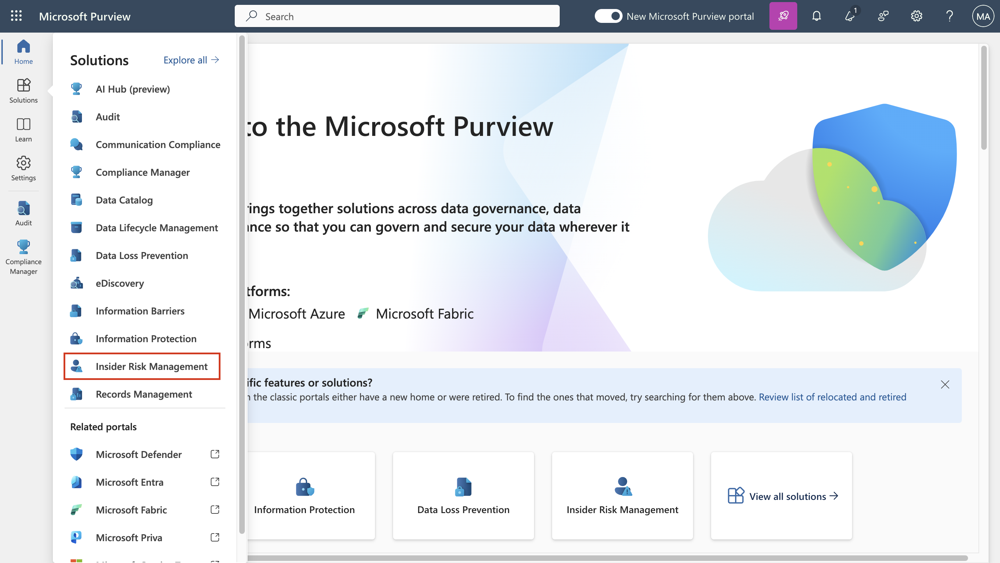
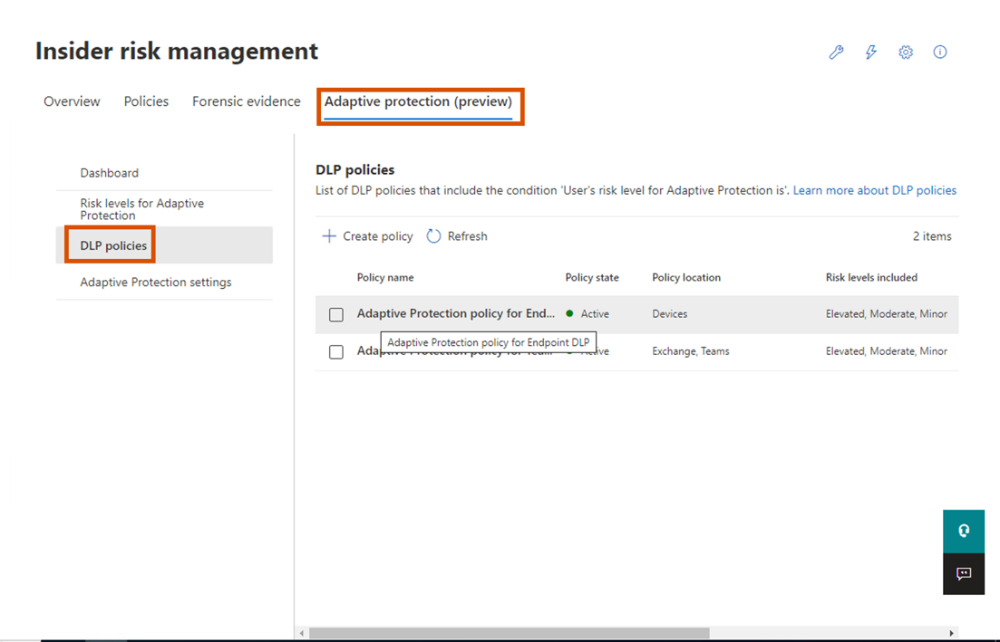
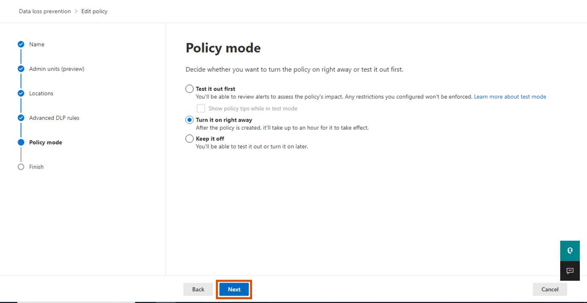
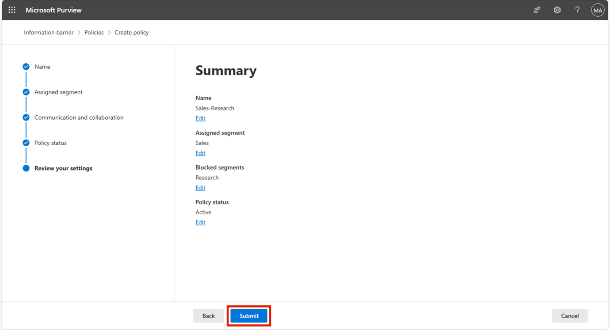
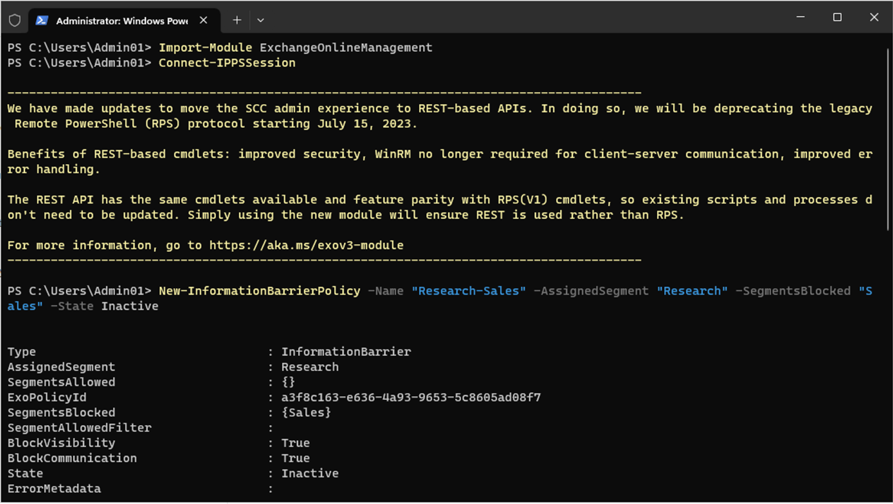
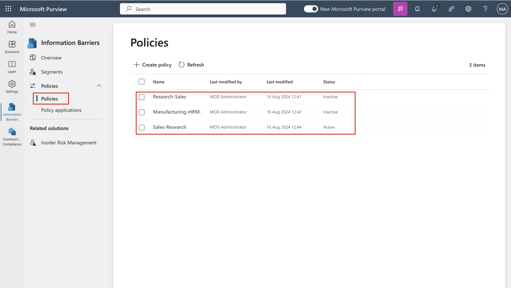
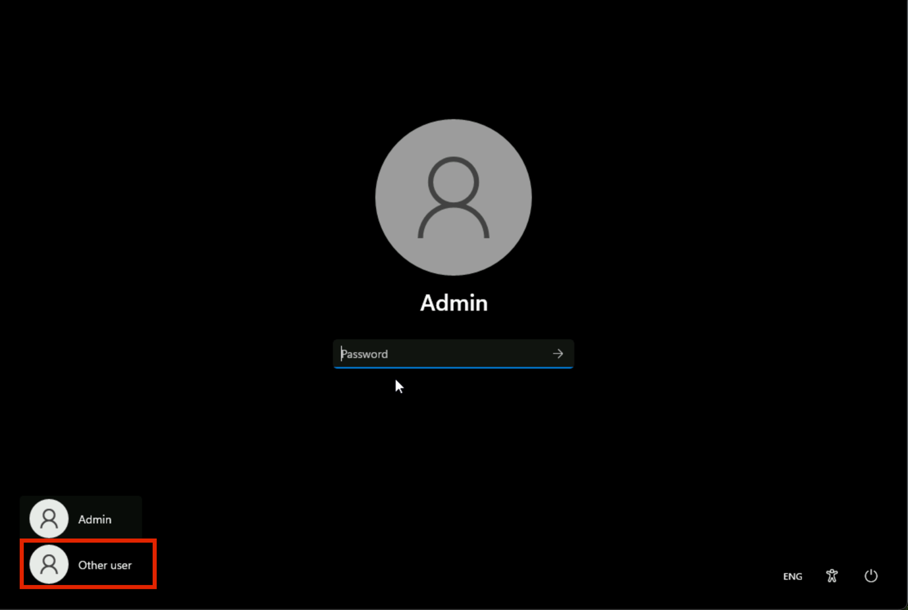

# Lab 8 – Configuring Information Barriers

## Objective:

Contoso has five departments: *HR*, *Sales*, *Marketing*, *Research*,
and *Manufacturing*. In order to remain compliant with industry
regulations, users in some departments aren't supposed to communicate
with other departments, as listed in the following table:

[TABLE]

For this structure, Contoso's plan includes three IB policies:

1.  An IB policy designed to prevent Sales from communicating with
    Research

2.  Another IB policy to prevent Research from communicating with Sales.

3.  An IB policy designed to allow Manufacturing to communicate with HR
    and Marketing only.

## Exercise 1 – Prerequisites

### Task 1 – Create segment for users in your organization

1.  On your VM, run **PowerShell** as an administrator.

2.  Run the following:

**+++Install-ModuleExchangeOnlineManagement+++**

3.  If prompted ‘**Do you want PowerShellGet to install and import the
    NuGet provider now?**’ and ‘**Are you sure you want to install the
    modules from 'PSGallery'?**’ type **y** and press enter.

4.  Run the following command once the installation is done.

**+++Import-Module ExchangeOnlineManagement+++**

5.  Now run the following command to connect to Exchange Online.

**+++Connect-IPPSSession+++**

6.  Log in using the **MOD Administrator** credentials given on the home
    page of the lab environment.

7.  Run the following command one by one in the **PowerShell** to create
    the organisation structure.

**+++New-OrganizationSegment -Name"HR" -UserGroupFilter"Department -eq
'HR'"+++**

**+++New-OrganizationSegment -Name"Sales" -UserGroupFilter "Department
-eq 'Sales'"+++**

**+++New-OrganizationSegment -Name"Marketing" -UserGroupFilter
"Department -eq 'Marketing'"+++**

**+++New-OrganizationSegment -Name"Research" -UserGroupFilter
"Department -eq 'Research'"+++**

**+++** **New-OrganizationSegment -Name "Manufacturing" -UserGroupFilter
"Department -eq 'Manufacturing'"+++**

### Task 2 – Enable scoped directory search in Microsoft Teams

To turn on search by name

1.  Go to Microsoft Teams admin center by going
    to **+++https://admin.teams.microsoft.com+++**,
    select **Teams** \> **Teams settings**.

2.  Under **Search by name**, next to **Scope directory search using an
    Exchange address book policy**, turn the toggle **On**.
    Select **Save**.

## Exercise 2 – Create IB policies

### Task 1 – Block communications between segments

1.  Sign into the **+++https://purview.microsoft.com/+++** using
    credentials for MOD Administration, given on the resources tab of
    your environment.

2.  In the left navigation pane, select **Information barriers**.

3.  In the sub-navigation, select **Policies**. On
    the **Policies** page, select **Create policy** to create and
    configure a new IB policy.

4.  On the **Name** page, enter a name for the
    policy—**+++Sales-Research+++**. Then select **Next**.

5.  On the **Assigned segment** page, select **Choose segment**. **On
    Select assigned segment for this policy** pane, select Sales. Now
    select **Add** to add the selected segment to the policy. You can
    only select one segment.

6.  Select **Next**.

7.  Under **Communication and collaboration**, select **Block**.
    Select **Choose segment**, select **Research** and then
    select **Add.**

8.  On the **Communication and collaboration** page, select the policy
    type Blocked in the **Communication and collaboration** field.
    Select **Next**.

9.  On the **Policy status** page, toggle the active policy status
    to **On**. Select **Next** to continue.

10. On the **Review your settings** page, review the settings you've
    chosen for the policy and any suggestions or warnings for your
    selections. Select **Edit** to change any of the policy segments and
    status or select **Submit** to create the policy.

11. Select **Done** once the policy is created.

### Task 2 – Create IB Policies via PowerShell

1.  On your VM, run **PowerShell** as an administrator.

2.  Run the following:

**+++Import-ModuleExchangeOnlineManagement+++**

3.  Now run the following command to connect to Exchange Online.

**+++Connect-IPPSSession+++**

4.  Log in using the **MOD Administrator** credentials given on the
    resources page of the lab environment.

5.  Run the following command to create an IB policy
    called **Research-Sales**. When this policy is active and applied,
    it will help prevent users who are in the **Research** segment from
    communicating with users in the **Sales** segment.

**+++New-InformationBarrierPolicy -Name "Research-Sales" -AssignedSegment "Research" -SegmentsBlocked "Sales" -StateInactive+++**

6.  Run the following command to create an IB policy
    called, **Manufacturing-HRMarketing**. When this policy is active
    and applied, **Manufacturing** can communicate only
    with **HR** and **Marketing**. HR and Marketing aren't restricted
    from communicating with other segments..

**+++New-InformationBarrierPolicy -Name "Manufacturing-HRMarketing"-AssignedSegment "Manufacturing"-SegmentsAllowed"HR","Marketing","Manufacturing"-State Inactive+++**

7.  Sign into the **+++https://purview.microsoft.com/+++** using
    credentials for **MOD Administration**, given on the home page of
    your environment.

8.  In the left navigation pane, select **Information
    barriers** \> **Policies**. On the **Policies** page. You will be
    able to see the policies that we created.

## Exercise 3 – Apply IB policies

1.  Sign into the **+++https://purview.microsoft.com/+++** using
    credentials for MOD Administration, given on the resources tab of
    your environment.

2.  In the left navigation pane, select **Information barriers**.

3.  In the sub-navigation, select **Policy applications**. Select
    **Apply all policies**.

**Summary:**

In this lab we learned how to create the segments to implement the IB
Policies. We created different policies to create information barriers
by allowing or blocking the communication and collaboration between
different segments.
