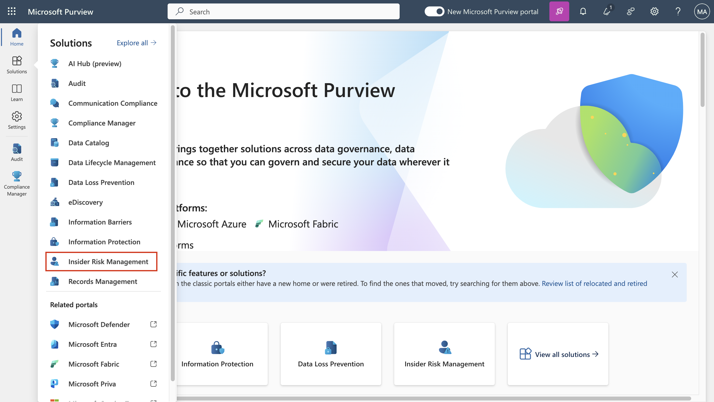
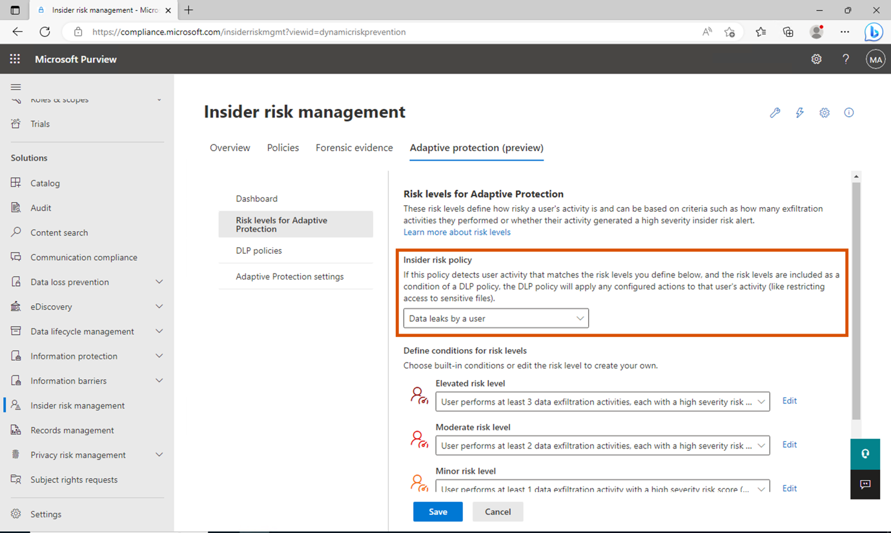
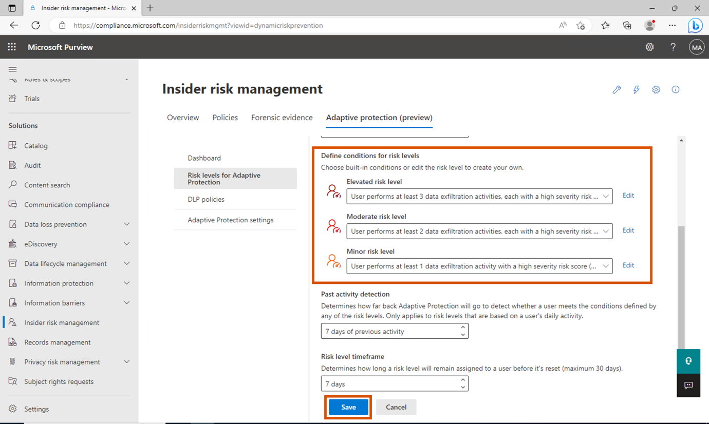

# Optional Lab B – Exploring the capabilities of Adaptive Protection

## Exercise 1 – Setting up Adaptive Protection

### Task 1 – Setting up risk levels for Adaptive Protection

1.  In Microsoft Edge, open a New InPrivate Window, navigate
    to **+++https://purview.microsoft.com+++** and log in using the
    admin tenant.

2.  From the navigation bar, go to **Solutions** \> **Insider risk**
    **management**.

3.  From the sub-navigation, select **Adaptive Protection (Preview)**.

4.  Since we used the quick start option while enabling **Adaptive
    Protection**, we can see 2 DLP policies created.

5.  Now click on **Risk levels for Adaptive Protection** from the
    submenu and from the drop down select **Data leaks by a user**.

6.  Under **Define conditions for risk levels**, select **User performs
    at least 3 data exfiltration activities,
    each…** for **Elevated** risk. Select **User performs at least 2
    data exfiltration activities, each… **for **Moderate** risk.
    **Select User performs at least 1 data exfiltration activities,
    each…** for **Minor** risk. Then click **Save**.

7.  Similarly, you can customise the conditions for all the available
    policy under Insider risk management.

8.  Now we can customise the DLP policy for each level.

Task 2 – Exploring Default DLP policies for each of the risk levels of
Adaptive Protection

1.  Under Adaptive Protection, select DLP Polices and select Adaptive
    Protection Policy for Endpoint DLP.

2.  Select **Edit**.

3.  Click on Next till you reach **Customize advanced DLP rules**.

4.  Check the rules and the conditions made for each level of risk.
    Click **Next**.

5.  On the **Policy mode** page select the radio button near **Turn it
    on right away**. Click **Next**.

6.  Select **Submit**.

7.  Repeat the steps to enable the Adaptive Protection Policy for Teams
    and Exchange DLP.

8.  We will not create any rules or policy as of now, but you can
    explore various available option after you complete the lab.
