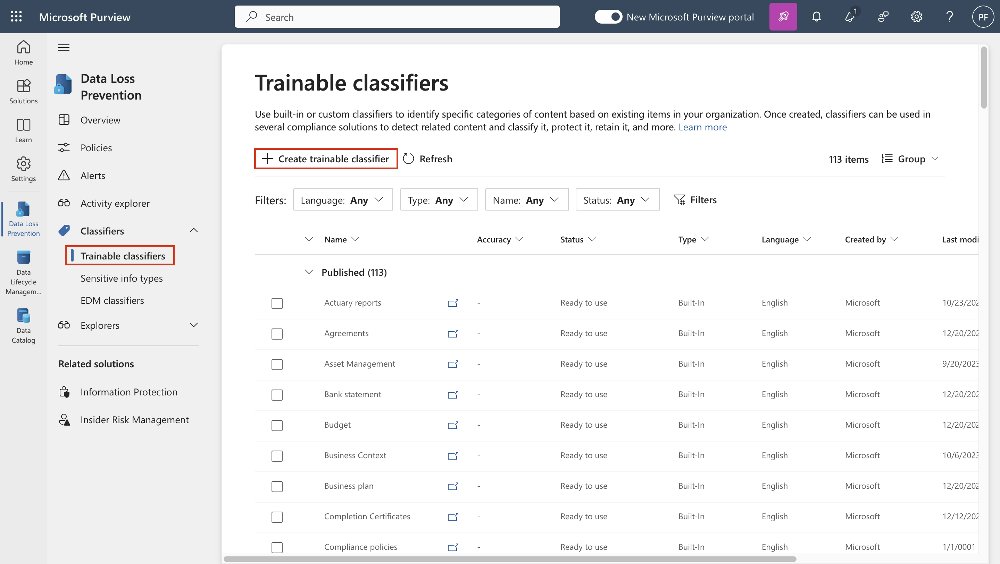
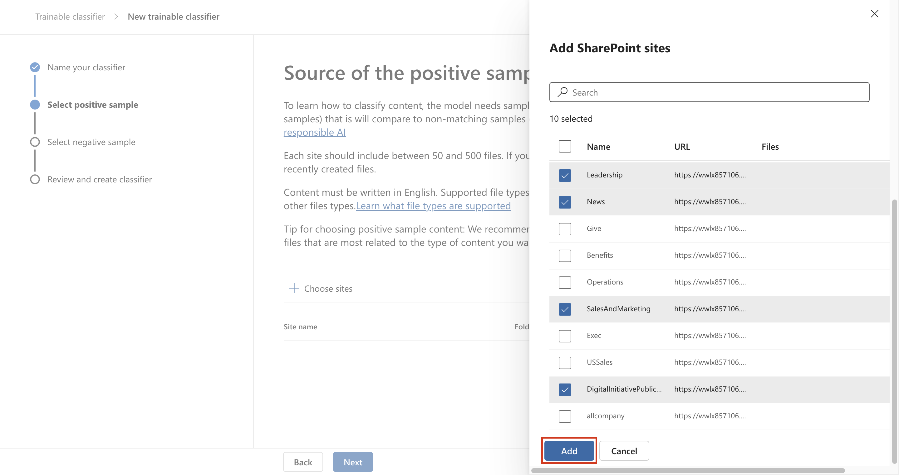

# Optional Lab C – Managing Trainable Classifiers

## Objective:

The Contoso Ltd. tenant contains a SharePoint site collection with the
name "Sales and Marketing" that will be used in the future to store
several financial related documents and reports. Because of the nature
of these documents, you need to create a trainable classifier to
recognize and label these files. For this purpose, you will activate
custom trainable classifiers and create a new one in this lab.

## Exercise 1 – Creating a trainable classifier

In this task, Patti will create a new trainable classifier and select
different SharePoint sites for identifying typical data created and
stored by Contoso Ltd.

1.  In **Microsoft Edge**, open a **New InPrivate Window**, navigate
    to **+++https://purview.microsoft.com+++** and log in as **Patti
    Fernandez** using the username **PattiF@WWLxXXXXXX.onmicrosoft.com**
    and the User Password given on your resources tab.

2.  From the left navigation, select **Solutions** \> **Data Loss
    Prevention**.

3.  

4.  

5.  

6.  

7.  

8.  

9.  

10. Expand **Classifiers** from the left pane. Select **Trainable
    Classifiers** from the sub-navigation pane. Select **+ Create
    trainable classifier** to create a new classifier.

11. Enter the following information on the **Name and describe your
    trainable classifier** page:

12. Name: **+++Contoso Company Data+++**

13. Description: **+++Trainable classifier for company data produced and
    stored by Contoso Ltd.+++**

14. Select **Next**.

15. Select **Choose sites** to open the right side pane.

16. Select the following SharePoint sites and select **Add**.

    - 

    - 

    - 

    - Brand

    - Digital Initiative Public Relations

    - Work

    - Sales and Marketing

    - 

    - Mark 8 Project Team

    - 

    - 

    - 

    - 

    - 

- 
- 
- 
- 
- 

17. Wait until the chosen site is shown in the list and select **Next**.

18. On the **Source of the negative sample content page**, select the
    site **Learn**, and then select **Next**.

19. Review the settings and select **Create trainable classifier**.

20. When the message Your trainable classifier was created is shown,
    select **Done**.

21. 

The documents and files in the chosen SharePoint site are now being
analyzed, which can take up to 24 hours.

You can explore the already existing classifiers for further review.

## 

1.  
2.  
3.  
4.  
5.  
6.  
7.  - 
    - 
    - 
    - 
    - 
    - 
    - 
    - 
    - 
    - 
    - 
    - 
    - 
    - 
    - 
    - 
    - 
    - 
    - 
    - 
8.  
9.  
10. 
11. 
12. 
13. 
14. 
15. 
16. 
17. 
18. 
19. 
20. 
21. 
22. 
23. 

## Summary:

You have successfully created a custom trainable classifier that matches
the files stored on the existing SharePoint sites of Contoso Ltd.
